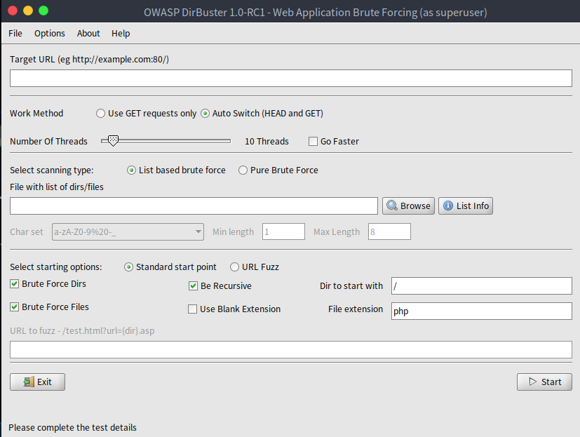
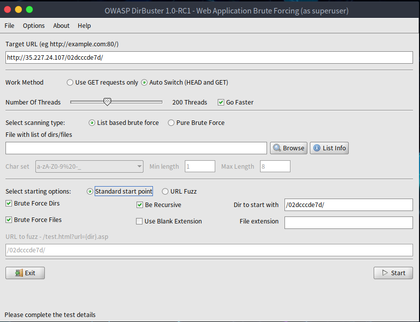

## DirBusterとは

DirBusterは、Web/アプリケーションサーバー上のディレクトリとファイル名を総当りで検索するアプリケーションです。Webアプリケーションにはリンクから辿れない数多くのページやアプリケーションが隠されています。DirBusterはこれらを総当りで見つけるためのツールです。

DirBusterの簡単な使い方を次に紹介します。

## Step1 DirBusterの起動

Parrot Security OSではデフォルトでインストールされているため、そちらを起動します。

## Step2 URLを指定

対象のWebアプリケーションのURLを指定してあげます。
今回は、Hacker101のPetshopProを対象にしていきます。

今回対象のWebアプリケーションは`http://35.227.24.107/02dcccde7d/`となるため、それを入力します。

## Step3 リストの選択

Scanする際に単純なBruteForceも可能ですが、あらかじめ用意されたリストを使用してそのリストをぶん回していく方法があります。今回はそのリストを使用します。

DirBusterには `/usr/share/dirbuster/wordlists/` の中にいくつかのリストがあるためそちらを使用します

## Step4 実行

準備ができたらStartを押して実行します。

設定の際にFile extensionやUse Blank ExtensionにチェックをいれることでScanする対象を選択することができます。

今回は時間の短縮のためScanの必要のないディレクトリは停止させたりしています。

## Step５ 結果

タブのResultに今までのスキャン結果が出ています。
今回のWebアプリケーションでは管理画面であるloginページは通常ではたどり着くことができませんでしたが、DirBusterを用いてスキャンすることで見事見つけることができました。

## 総括

DirBusterを用いれば秘匿されたWebアプリケーションのディレクトリやファイルの検索を行うことができます。
しかし、BruteForceでの検索となるため、目的のファイルやディレクトリを発見するのに時間がかかることがわかります。
またサービスに多量のリクエストが送られるため、許可された環境下でのみ使用してください。
