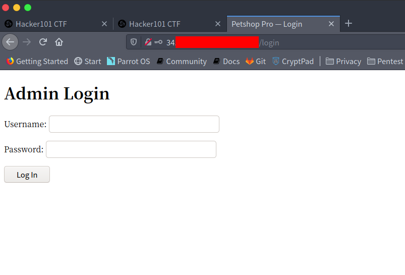
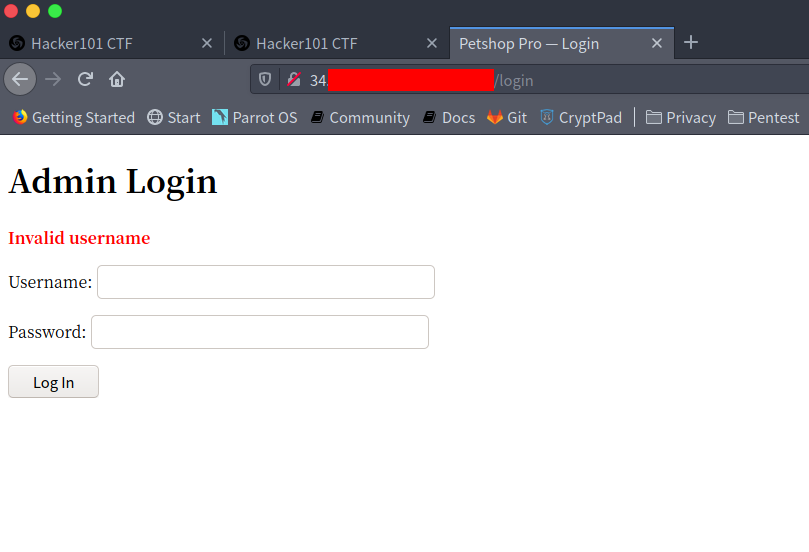
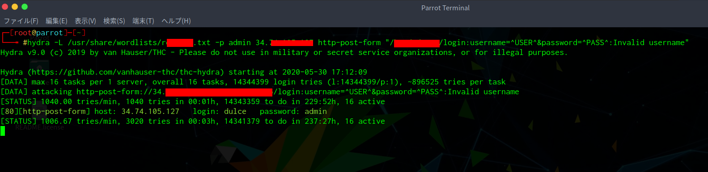
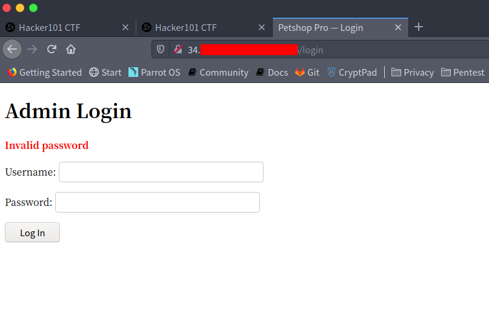
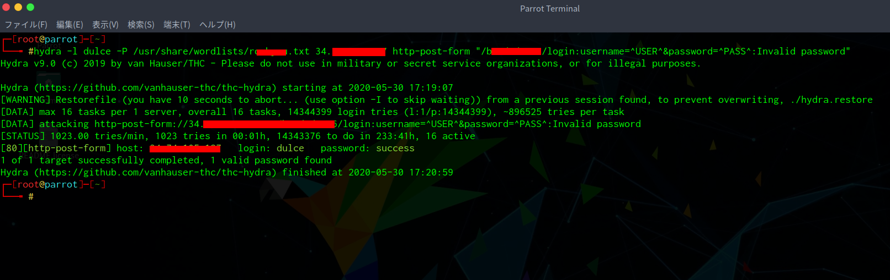
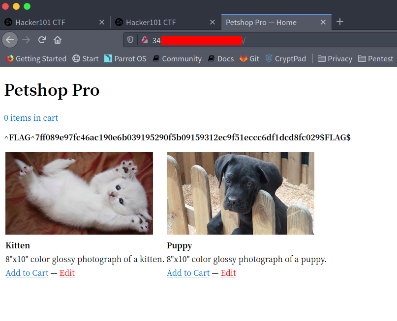

## hydraとは

Hydraはリモート認証サービスをブルートフォースクラッキングをする際によく用いられているツールになります。ftp,http,https,smbなど様々なプロトコルをサポートしています。
Hydraでは並列処理することにより高速にパスワードクラッキングを行うことができます。

## 使い方

コマンドラインでの使用法は次のとおりです。

```bash
hydra [some command line options] [-s PORT] TARGET PROTOCOL [MODULE-OPTIONS]
```

コマンドラインオプションなどを使用してパスワードやユーザ名などを指定することができます。
コマンドラインオプションには、以下のようなものを指定することができます。

```bash
Options:
  (省略)
  -l LOGIN or -L FILE  login with LOGIN name, or load several logins from FILE
  -p PASS  or -P FILE  try password PASS, or load several passwords from FILE
  (省略)
```

これらのコマンドラインオプションを使用して、思考するログインユーザ、パスワード、SSLの有無、攻撃に使用する並列タスク数などを指定することができます。

PROTOCOLは、攻撃にしようするプロトコルです。ftp,smtp,http-getなど様々なものを指定することができます。
また、サポートされているプロトコルにも様々なものがあり、プロトコル毎に特別なオプションがあります。
プロトコル毎の詳しいオプションを確認するには、以下のコマンドのように使用します。

```bash
$ hydra -U http-post-form
(省略)
Examples:
 "/login.php:user=^USER^&pass=^PASS^:incorrect"
 "/login.php:user=^USER64^&pass=^PASS64^&colon=colon\:escape:S=authlog=.*success"
(省略)
```

## 実験

今回はHacker101のPetshop Proを対象にしていきます。
Petshop Proのログイン画面は以下の様になっています。



ここで適当なadmin:adminなどでログイン試行した結果がこちらです。



Invalid usernameという文字列が表示されました。こちらが今回正しくログインできなかったときの識別として用います。

hydraでhttp-post-formを用いてusernameの総当りをしていきます。
usernameの総当りをしていくにあたり適当なwordlistを指定してあげます。



無事usernameがdulceのときInvalid usernameが表示されないことがわかりました。
ブラウザでdelce:adminでログイン試行してみると



となり、passwordが異なることがわかりました。

続いて、パスワードも同様に総当りで試行していきます。



無事パスワードもわかったのでログインしてみます。



フラグが表示され、ログイン完了したことがわかります。

## まとめ

Hydraを用いることでログインの総当りをすることができることがわかりました。
しかし、今回用いられたusername:passwordがwordlistになければいたずらに時間が使われることもわかります。

また、hydraは許可された環境下でのみ使用をしてください。
