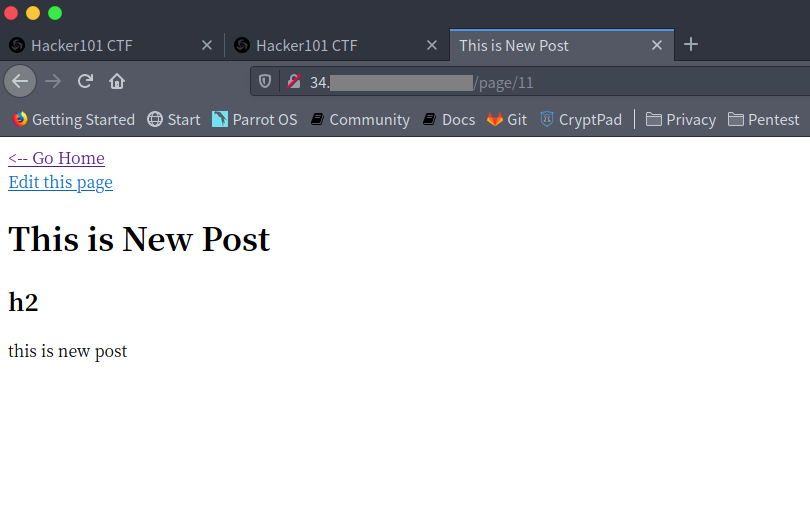
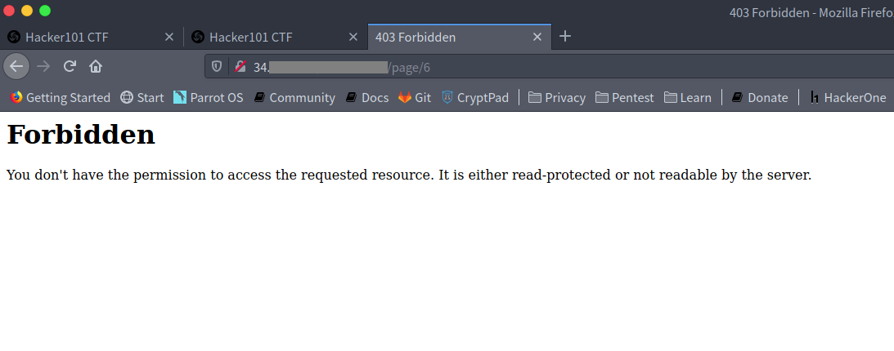
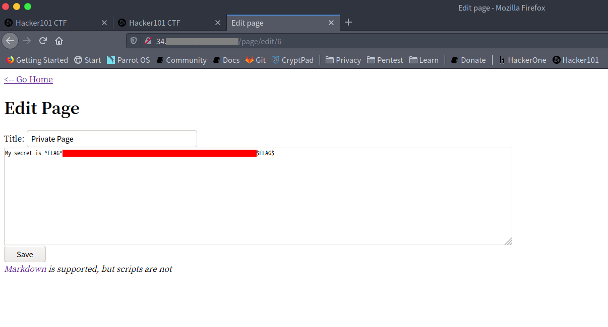
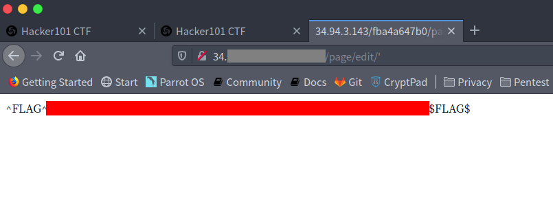
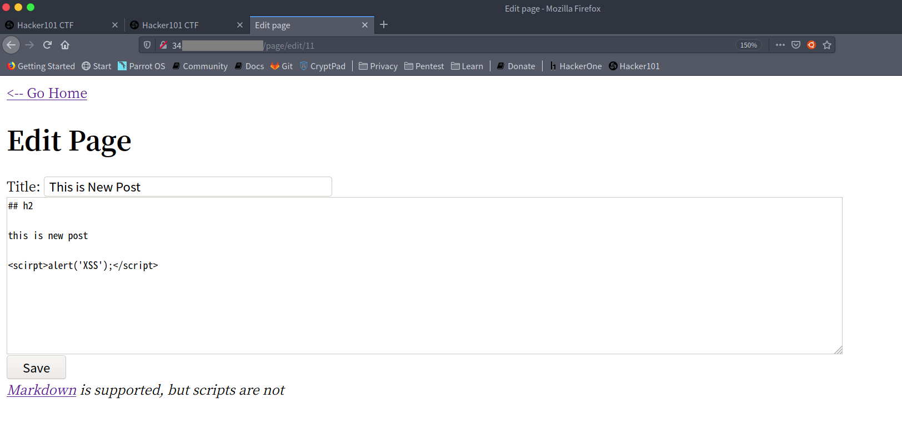
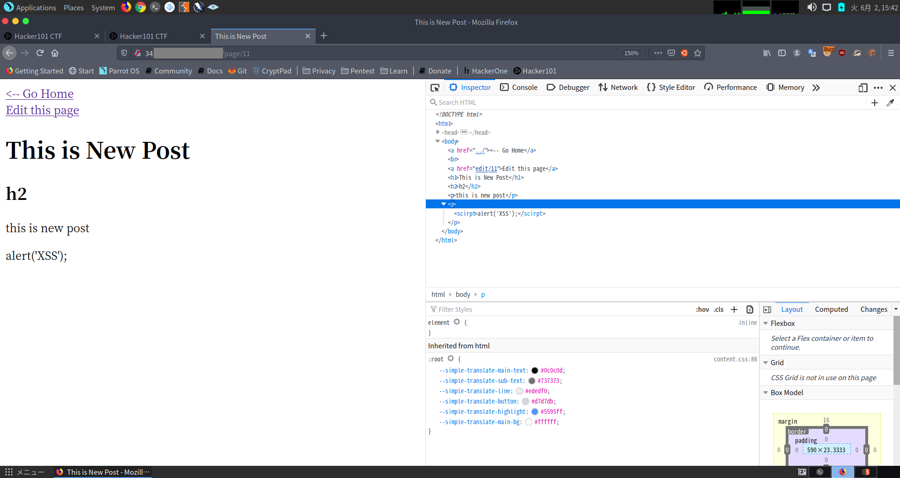
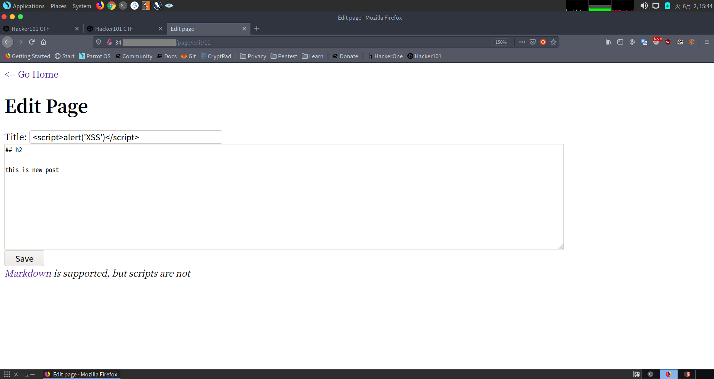
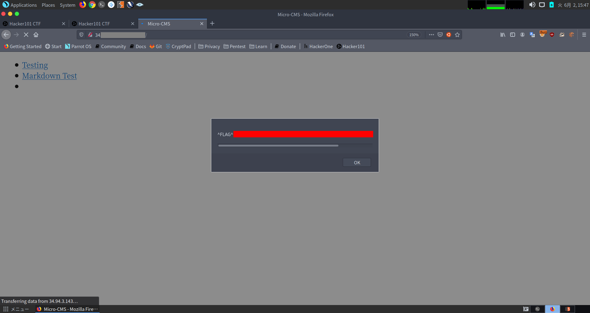
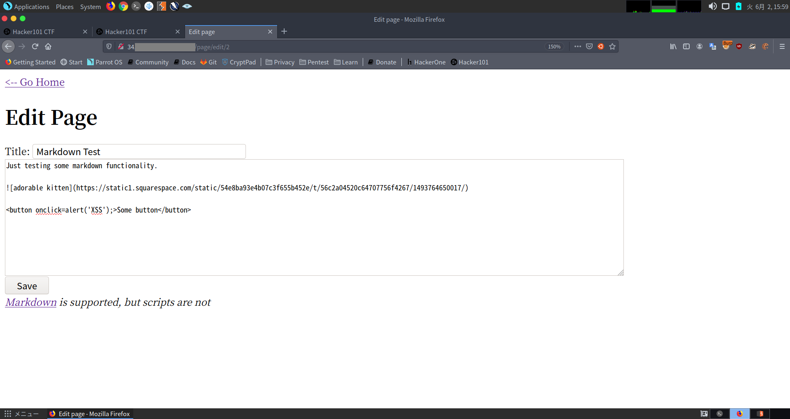
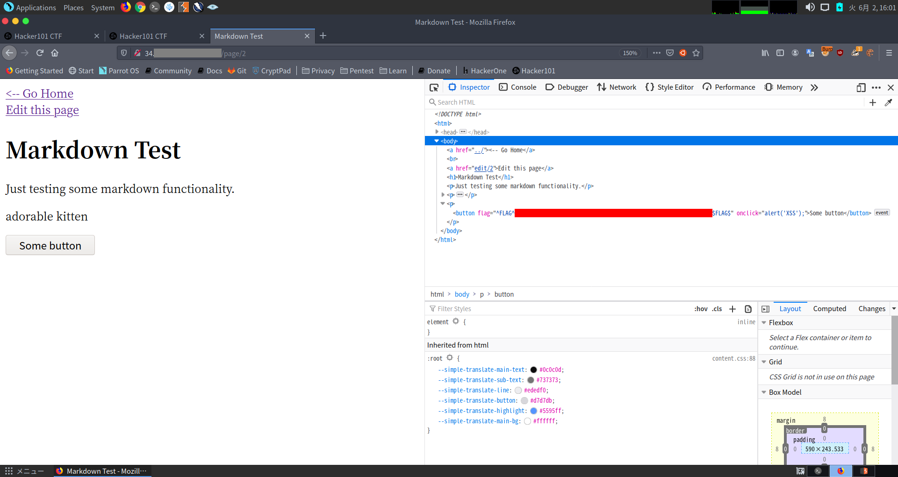

**注意** CTFの解法が以下に載っています。自力で解きたい方は解法を見る前にブラウザバックしてください。

## 概要

Micro-CMS v1ではMarkdown形式で記述されたものを作成、編集、閲覧などができるサービスでした。
最初にTesting, Markdown Testというページがありそれらの編集などもできるようなサービスでした。

## Flag0

Create a new pageから試しにページを作成してみると、作成されたページのindexが11であることに気が付きます。

Testing, Markdown Testは1,2と連番だったのにいきなり11になるのはおかしいと感じ、3~10までindex番号を変更して見てみると、indexが"6"のときだけ403 Forbidden Errorが出ました。

直接参照する際には権限周りで怒られていましたが、editページに飛んで見ると見事Flagを回収することができました。

## Flag1

Flag1では、編集ページの入力値の改ざんを行うことでFlagを回収することができました。

入力値はFormの値だけではなく、URLのパスからも意図しない入力値が送られることがあります。

editページでは数字が入力されるのを期待していましたが、数値以外のもの、シングルクオート(')を与えてあげることでFlagを取得することができました。

## Flag2

みんな大好きXSSです。

入力を表示させるようなページがある場合はみんな試すと思いますので脳死で`<scirpt>alert('XSS');</scirpt>`を入力しましょう。

しかしXSSが表示されるところは詳細ページでは起こりません。

入力されたものが影響を与えるのは詳細ページだけではありません。

今回はTitleにXSSのスクリプトタグを入力してみましょう。

そして、Homeに戻ってみると、無事Flagが回収することができました。

## Flag3

XSSはscriptタグで囲まれた場所以外にも発生します。

今回はbuttonからクリックした際にXSSが発生するようにしました。

Webページによっては"script"という文字列を置換してスクリプトを実行させないようにするようなサイトもありますが、onclickを用いることでscirptという文字列を使用せずにXSSを発生させることができます。

こちらも無事Flagを回収することができました。

## まとめ

比較的基本に忠実な問題ばかりでした。
CTF初学者や始めてみたい人にとってWriteUPを見ながらでもいいので解いてみて解き方の感覚を掴むのにもってこいの問題だと思います。
