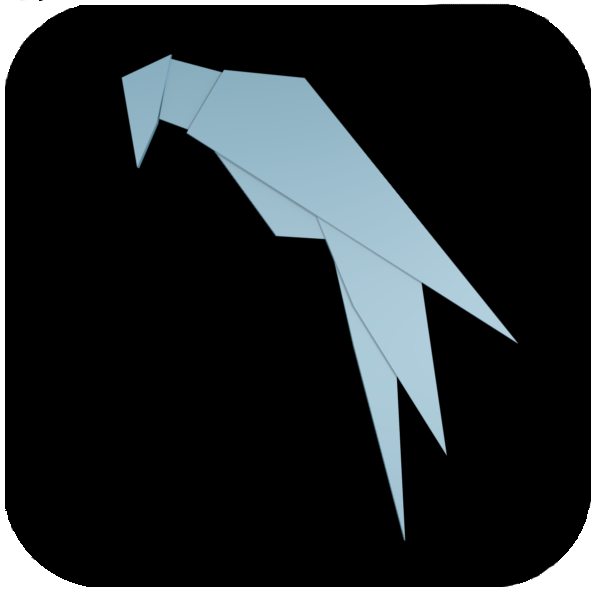

## Parrot Security OS とは

Parrot Security OSはイタリアで開発が行われている、セキュリティとプライバシーを念頭に置いて設計されたDebianベースのGNU/Linuxです。

ペネトレーションテストから、デジタルフォレンジック、リバースエンジニアリングまで、あらゆる種類のサイバーセキュリティ運用のためのツールが含まれています。


## Kali Linuxとの違い

Kali Linuxとどっちがより良いかなどよく比較されます。
基本的に含まれているツール群はKaliにあったらParrotにもあります。

Kaliはペネトレーションテストに特化したOSなのに対し、ParrotはHOME版も出しており、普段使いにもできるような印象があります。

また、「AnonSurf」というすべての通信をTorを用いて通信を行うようにするアプリケーションは、Kaliにはデフォルトでインストールされていないため、その点ではKaliに勝っています。

また、デスクトップ環境にも違いがあります。
Kali LinuxではGnomeを、ParrotではMATEを採用しています。
VirtualBox上で動かす上で、限られたリソースで動作させなくてはいけないため、軽いデスクトップ環境のMATEのほうが無難です。

海外のコミュニティなどでも検索をかけてみましたが、Parrotを好んで使っている、Parrotを勧めているようなコメントもありました。

今までごたごたと語ってきましたが、結局は見た目と好みで選んでいいと思います。

## インストール

### ISOダウンロード

まずはParrotのホームページから、isoをダウンロードしてきてください。

<iframe class="hatenablogcard" style="width:100%;height:155px;margin:15px 0;" title="Parrot OS Dowload Home Edition" src="https://hatenablog-parts.com/embed?url=https://parrotlinux.org/download/" frameborder="0" scrolling="no"></iframe>

> [https://parrotlinux.org/download/](https://parrotlinux.org/download/)

MATE版、KDE版、OVA版がありますが、自分で一から設定したいためOVA版はパス。


MATEとKDEですが、ノートPCなどに直接インストールするのであればKDEもありです。
自分も普段使いのManjaroLinuxは、KDEを採用しています。

しかし、VM上に展開するには重い印象があります。

あと、MATE版はとても綺麗に作られていたのですが、KDE版のデスクトップほとんどデフォルトって感じであまり好みではなかったです。

KDE版にはそこまで力をいれていないのかなって印象です。

### VirualBoxのマシン作成

#### 1. 新規作成

新しい仮想マシンを作成します。


#### 2. 名前とオペレーティングシステム

適当に好きな名前をつけます


#### 3. メモリーサイズ

メモリサイズを設定します。
メモリが2GBとかの化石PCを使ってる人なんてもういないと思うので、4GBとか8GBとか当ててください。


#### 4.1 ハードディスク

新しく仮想ハードディスクを選択してください。


#### 4.2 ハードディスクのファイルタイプ

提案されているものそのままで大丈夫です。


#### 4.3 物理ハードディスクにあるストレージ

書いてあるとおりです。
今回は可変で作成しますが、固定でもいいです。
ぶっちゃけどちらでもいいです。


#### 4.4 ファイルの場所とサイズ

自分がいま使っている状況で20GB程度使用しているため、それ以上は絶対必要です。
自身の空き容量と相談してください。


無事、新しくマシンが作成されました。


次は設定に移ります。

### VirtualBoxのマシン設定

#### 一般

高度タブからクリップボード、ドラッグアンドドロップを双方向にしてください。
後にGuestAdditionsを導入した際に便利になります。


#### システム

チップセットをICH9、ポインティングデバイスをUSBマルチタブレットにしてください。
これが一番最新の設定らしいです。
これが原因で動かないとかはないですが、しておいて損はないです。


#### プロセッサ

自分はホストの半分のプロセッサ数を割り振ってます。
また、PAE/NXを有効化しておいてください。


#### ディスプレイ

ビデオメモリですが、ディスプレイ数が1の時は128MBが最大です。


ビデオメモリを増やしてあげると、256MBまで増えます。
ワザップですね。


ちなみに、3Dアクセラレーションにもチェックを入れておいてください。

#### ストレージ

ここからディスクファイルを選択し、Parrotのisoイメージを選択してあげてください。


先程空だったところにisoイメージが挿入されていると思います。
Live CD/DVDにチェックをいれます。


一度OKを押し、設定を終了します。


#### Re:スクリーン

このままではスクリーン数が8のままなので、それを1つにしていきます。
スクリーン数を変更してもビデオメモリは256MBのままですね！


#### グラフィックコントローラー

起動する前に、グラフィックコントローラを変更します。
この画面のVMSVGAというところをクリックし、VBoxSVGAを選択してあげます。


これで起動する準備が整いました。
起動しましょう。


### 仮想マシンの起動

LiveCDが起動します。十字キーを使ってinstallを選択します。


GUIでインストールを行いたいため、そちらを選択します。


ここからはマウスが使えるので簡単だと思います。
日本語を選択しましょう。


警告が出ますが、日本語の翻訳が追いついてなくて英語になる可能性あるよってだけです。
はいを選択していいでしょう。


住んでいる地域を選択します。


キーボードの設定です。
自分はUSキーなので米国を選択しますが、日本語も選択できます。


rootのパスワードの設定画面が開きます。


ユーザの設定です。
こちらはスペースや大文字が入っても大丈夫です。


アカウントのユーザ名です。
これをもとにディレクトリが作成されるため、半角英数字で設定してあげます。


パスワードの設定です。
短すぎると警告を受けた気がするので、長い方がいいです。


ディスクのパーティショニングです。
ディスク全体を使うを選択します。


こちらで、ディスクがVBoxのものであるか、自分が設定したディスクサイズに近いかどうかを確認してください。
確認が済んだら続けるでOKです。


すべてのファイルを１つのパーティションにを選択します。


スワップスペースについての警告ですが、8Gもメモリ積んでればスワップはいらないので無視します。
いいえで大丈夫です。


ディスクをこれで作っていいか確認が来るので、はいを選択します。


ディスクにインストールしています。
コーヒーでも飲んで待ちましょう。


ブートローダーの設定が出てきました。
OSをブートする際に必要なのではいを選択します。


VBOXのハードディスクを選択し、続けるで大丈夫です。


インストールが完了しました。
続けるを押してください。


しばらく待っていると、再起動が始まりログイン画面が出てきました。
お疲れ様でした。VirtualBoxにインストールが完了しています。


## パッケージアップグレード

Parrot Security OSではパッケージのアップデートにラッパーコマンドがあります。

端末を開いて以下のコマンドを実行するだけで自動的にパッケージの更新をしてくれます。

```bash
sudo parrot-upgrade
```


ログインした際に毎回確認をして、最新の状態を保つようにしてください。

## まとめ

セキュリティ機能に特化したParrot Security OSをVirtualBoxにインストールする手順をまとめました。

今回vmwareを選択しなかった理由としては、VirtualBoxではスナップショットを取ることができるため、もしマルウェアなどに感染してしまった場合などに過去の状態にすぐに戻ることができるからです。

CTFや脆弱性診断をする際に、Parrot Security OS 使ってみてください。
