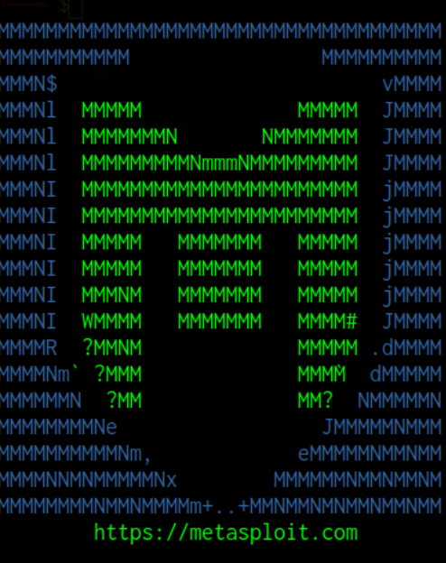
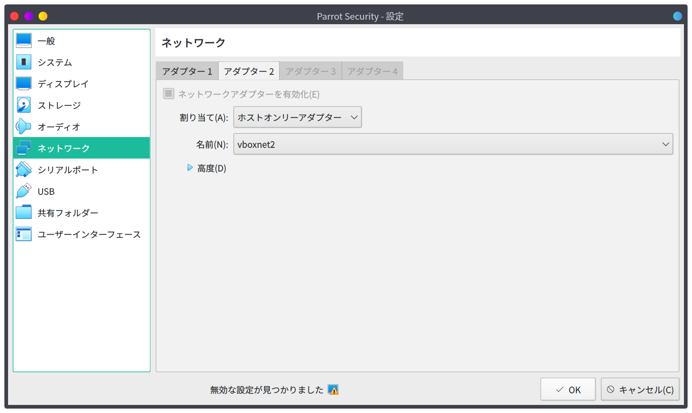

# Metasploitable3 とは

Metasploitable3はわざと脆弱性をもたせたマシンです。このマシンに対してToolの検証やexploitを行います。

普段ペンテストの勉強などをしている際に、有用なツールを見つけたとしてもぶっつけ本番で行うわけには行きません。
テストをする場所を作り、そこで使い方の勉強をしていったほうがいいです。

<iframe class="hatenablogcard" style="width:100%;height:155px;margin:15px 0;" title="rapid7/metasploitable3: Metasploitable3 is a VM that is built from the ground up with a large amount of security vulnerabilities." src="https://hatenablog-parts.com/embed?url=https://github.com/rapid7/metasploitable3" frameborder="0" scrolling="no"></iframe>

> [https://github.com/rapid7/metasploitable3](https://github.com/rapid7/metasploitable3)

# 環境構築

## 構築環境＆バージョン

それでは、metasploitable3の環境を構築していきます。
自分の環境とそれらのバージョンは以下の通りです。

- Host OS: Manjaro Linux x86_64
- VirtualBox: 6.1.14
- Vagrant: 2.2.10
- Packer: 1.6.2

基本的にはgithubに書いてあることをなぞっていくので、よく読んでおくことを勧めます。

## インストール

### Packer Install

Packerのインストールです。
自分はManjaro Linuxを使っているのでpacmanで一発で入ります。

```bash
sudo pacman -S packer
```

### Vagrant Install

ありがたいことにvagrantもありました。
こちらもインストールしていきます。

```bash
sudo pacman -S vagrant
```

### Vagrant Reload Plugin Install

vagrantのプラグインであるVagrant Reload Pluginをインストールしていきます。

```bash
vagrant plugin install vagrant-reload
```

ここまでは下準備です。
それではMetasploitableの環境を構築していきます。

### Metasploit3 Install

今回はrapid7で提供されているビルド済みのイメージを使います。

自身でビルドする場合もgithubページに書いてあるのでそちらをなぞって構築してもいいでしょう。

```bash
mkdir metasploitable3-workspace
cd metasploitable3-workspace
curl -O https://raw.githubusercontent.com/rapid7/metasploitable3/master/Vagrantfile && vagrant up
```

ただ、2020年9月現在では、Windowsの環境構築の際にエラーが吐かれてしまい、止まってしまいました。

### How to Fix

止まってしまったときのエラー分が以下になります。

```bash
There was an error loading a Vagrantfile. The file being loaded
and the error message are shown below. This is usually caused by
an invalid or undefined variable.

Path: /home/username/.vagrant.d/boxes/rapid7-VAGRANTSLASH-metasploitable3-win2k8/0.1.0-weekly/virtualbox/Vagrantfile
Line number: 0
Message: undefined local variable or method `win2k8'
```

win2k8がないみたいなことを言われていますね。

調べてみると解決法が見つかりました。

ここからは推測になりますが、rapid7にて提供されているVagrantfileが若干古いor名前が違うみたいで、最初にダウンロードしたVagrantfileとの整合性があっていないように感じます。

そこをちょちょちょいと修正してあげるとうまく行きます。

<iframe class="hatenablogcard" style="width:100%;height:155px;margin:15px 0;" title="vagrant: undefined local variable or method `win2k8' · Issue #481 · rapid7/metasploitable3" src="https://hatenablog-parts.com/embed?url=https://github.com/rapid7/metasploitable3/issues/481" frameborder="0" scrolling="no"></iframe>

> [https://github.com/rapid7/metasploitable3](https://github.com/rapid7/metasploitable3)

Vagrantfileの編集を行います。

```bash
nvim ~/.vagrant.d/boxes/rapid7-VAGRANTSLASH-metasploitable3-win2k8/0.1.0-weekly/virtualbox/Vagrantfile
```

編集後のファイルの中身が以下になります。

```Vagrantfile
# The contents below were provided by the Packer Vagrant post-processor

Vagrant.configure("2") do |config|
  config.vm.base_mac = "080027D0BF18"
end


# The contents below (if any) are custom contents provided by the
# Packer template during image build.
# -*- mode: ruby -*-
# vi: set ft=ruby :

Vagrant.require_version ">= 1.6.2"

Vagrant.configure("2") do |config|
  config.vm.synced_folder '.', '/vagrant', disabled: true
  config.vm.define "win2k8" do |win2k8|
    win2k8.vm.box = "rapid7/metasploitable3-win2k8"
    win2k8.vm.hostname = "metasploitable3-win2k8"
    config.vm.communicator = "winrm"

    # Admin user name and password
    config.winrm.username = "vagrant"
    config.winrm.password = "vagrant"

    config.vm.guest = :windows
    config.windows.halt_timeout = 15

    config.vm.network :forwarded_port, guest: 3389, host: 3389, id: "rdp", auto_correct: true
    config.vm.network :forwarded_port, guest: 22, host: 2222, id: "ssh", auto_correct: true

    config.vm.provider :virtualbox do |v, override|
        #v.gui = true
        v.customize ["modifyvm", :id, "--memory", 2048]
        v.customize ["modifyvm", :id, "--cpus", 2]
        v.customize ["setextradata", "global", "GUI/SuppressMessages", "all" ]
        v.customize ["modifyvm", :id, "--clipboard", "bidirectional"]
    end

    config.vm.provider :vmware_fusion do |v, override|
        #v.gui = true
        v.vmx["memsize"] = "2048"
        v.vmx["numvcpus"] = "2"
        v.vmx["ethernet0.virtualDev"] = "vmxnet3"
        v.vmx["RemoteDisplay.vnc.enabled"] = "false"
        v.vmx["RemoteDisplay.vnc.port"] = "5900"
        v.vmx["scsi0.virtualDev"] = "lsilogic"
    end

    config.vm.provider :vmware_workstation do |v, override|
        #v.gui = true
        v.vmx["memsize"] = "2048"
        v.vmx["numvcpus"] = "2"
        v.vmx["ethernet0.virtualDev"] = "vmxnet3"
        v.vmx["RemoteDisplay.vnc.enabled"] = "false"
        v.vmx["RemoteDisplay.vnc.port"] = "5900"
        v.vmx["scsi0.virtualDev"] = "lsisas1068"
    end

    win2k8.vm.provider "libvirt" do |v|
      v.memory = "2048"
      v.cpus = "2"
      v.video_type = 'qxl'
      v.input :type => "tablet", :bus => "usb"
      v.channel :type => 'unix', :target_name => 'org.qemu.guest_agent.0', :target_type => 'virtio'
      v.channel :type => 'spicevmc', :target_name => 'com.redhat.spice.0', :target_type => 'virtio'
      v.graphics_type = "spice"

      # Enable Hyper-V enlightenments: https://blog.wikichoon.com/2014/07/enabling-hyper-v-enlightenments-with-kvm.html
      v.hyperv_feature :name => 'stimer',  :state => 'on'
      v.hyperv_feature :name => 'relaxed', :state => 'on'
      v.hyperv_feature :name => 'vapic',   :state => 'on'
      v.hyperv_feature :name => 'synic',   :state => 'on'
    end
  end
end
```

最後に立ち上げて終了です。

```bash
vagrant up
```

# ネットワーク設定

自分の環境では、VirtualBoxで攻撃用のマシンを構築しています。

攻撃用のマシンの構築手順ですが、記事にしてあるのでこちらを参考にしてみてください。

<iframe class="hatenablogcard" style="width:100%;height:155px;margin:15px 0;" title="セキュリティに特化したParrot Security OSをVirtualBoxにインストールするまで – YKK" src="https://hatenablog-parts.com/embed?url=http://blog.yuk1h1ra.me/posts/2020/09/install-parrot-security-os/" frameborder="0" scrolling="no"></iframe>

> [https://blog.yuk1h1ra.me/posts/2020/09/install-parrot-security-os/](https://blog.yuk1h1ra.me/posts/2020/09/install-parrot-security-os/)

いま作ったMetasploitableとのネットワークの設定をしてあげます。
攻撃用のマシンの設定を開き、ネットワークからホストオンリーアダプタを選択します。
ネットワークはMetasploitable3と同じネットワークにしてあげて完了です。



# おわりに

今回は脆弱性をあえてもたせた仮想マシンの紹介と構築方法についてまとめました。

このマシンを使って、ペンテストツールの検証や、自身の勉強に役立てていこうと思います。
