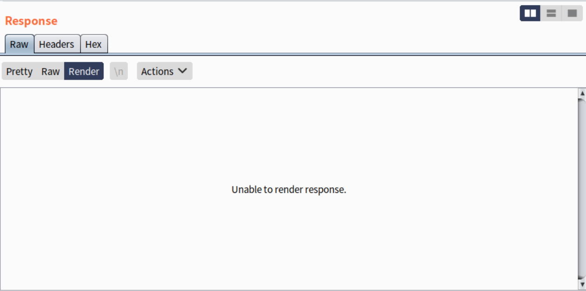
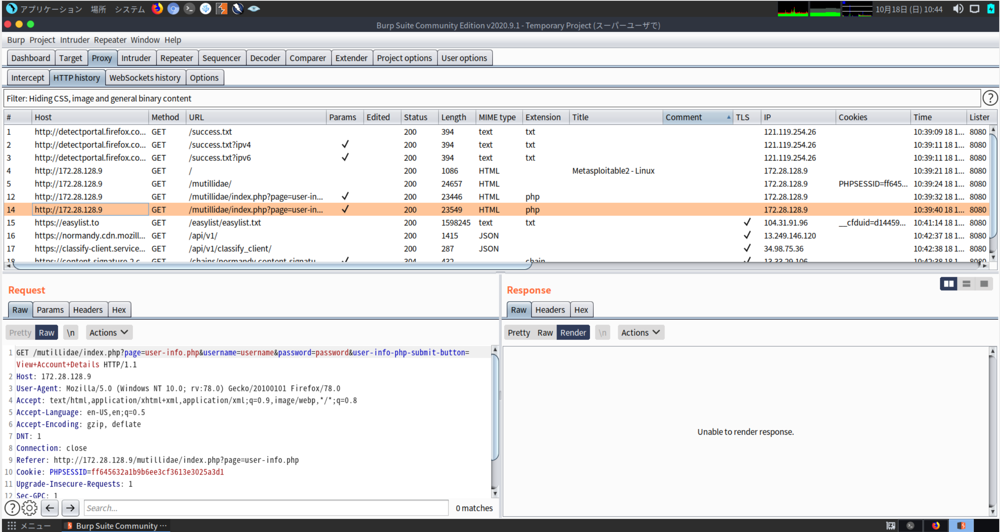
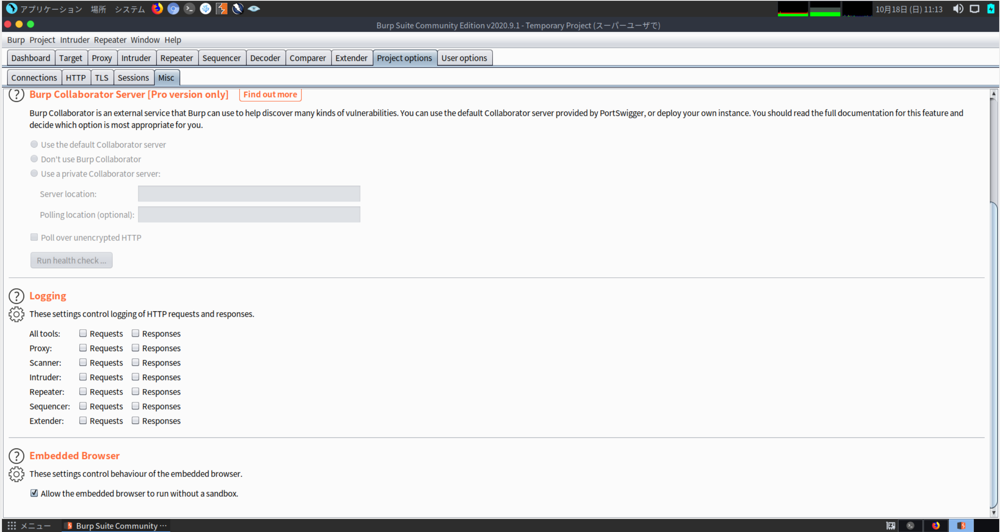

## 始めに

自分はParrot Security OSを仮想環境下で使用しています。その時にBurpSuiteのWebレンダリング機能がうまく機能していなかったため、その解決方法を記事にしました。

エラーが起きた際のバージョンを以下に乗せておきます。

- Parrot Security OS: 4.1.0
- Burp Suite: 2020.9.1-3995 Burp Suite Community Edition

## 問題点

Burp SuiteのResponseにて、RenderタブでWebページを表示させようとした際に、_Unable to render response_ や _Embedded browser initialization failed_ のエラーが表示され、Webページを表示されていないことがありました。

## 解決法

Burp Suiteの開発元であるPortSwiggerがTwitterにて解決法をツイートしていました。

<blockquote class="twitter-tweet">
Hi, if you are running as root are you able to turn off the sandbox under Project options -&gt; Misc -&gt; Embedded Browser -&gt; Allow the embedded browser to run without a sandbox?
&mdash; Burp Suite (@Burp_Suite) <a href="https://twitter.com/Burp_Suite/status/1295619292667543552?ref_src=twsrc%5Etfw">August 18, 2020</a></blockquote> 

> [https://twitter.com/Burp_Suite/status/1295619292667543552?ref_src=twsrc%5Etfw](https://twitter.com/Burp_Suite/status/1295619292667543552?ref_src=twsrc%5Etfw)

つまり、
`Project options -> Misc -> Embedded Browser -> Allow the embedded browser to run without a sandbox`
にの順にチェックを入れてあげます。

これで正しく表示されるようになりました。

## 終わりに

BurpSuiteを用いて脆弱性診断をする際に、目に見える形で確認したい場合が多々あります。
今後このようなエラーが起きた際に、この記事が参考になって解決されることを祈っています。
