## 始めに

Webアプリケーションの脆弱性診断をする際にプロキシツールを持ちいて診断をしているかと思います。

今回はBurpSuiteとWfuzzのwordlistを用いてSQLインジェクションの脆弱性診断の方法を紹介したいと思います。

## 脆弱性を含んだマシンの用意

今回はMetasploitable2を用いります。

以下のサイトからDownloadし、Virtualbox上に構築してください。

<iframe class="hatenablogcard" style="width:100%;height:155px;margin:15px 0;" title="Metasploitable download | SourceForge.net" src="https://hatenablog-parts.com/embed?url=https://sourceforge.net/projects/metasploitable/" frameborder="0" scrolling="no"></iframe>

> [https://sourceforge.net/projects/metasploitable/](https://sourceforge.net/projects/metasploitable/)

構築が終わったらネットワークの設定をしてあげます。

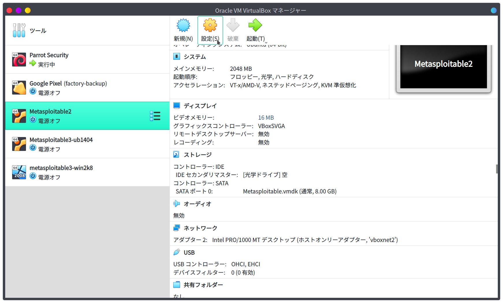

設定を開き、ネットワークからNATネットワークのチェックを外します。

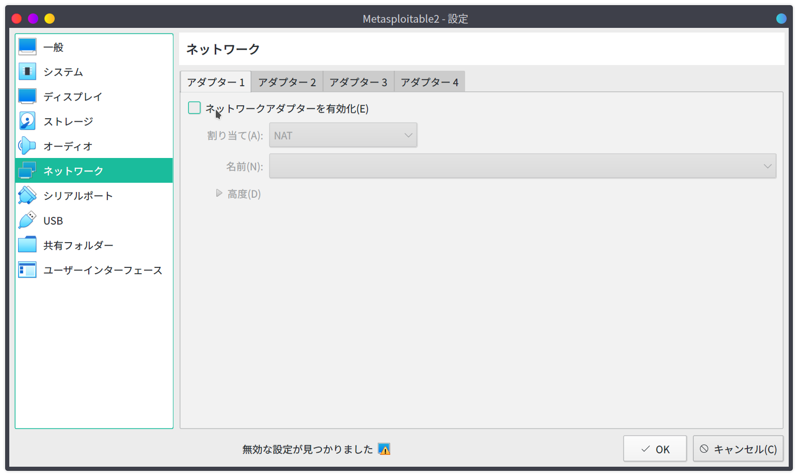

アダプター２にチェックをいれて、ホストオンリーアダプターを選択してあげます。
名前は自分の環境ではvboxnet2です。攻撃用のマシンも同様にホストオンリーアダプターのネットワークを有効にしてください。

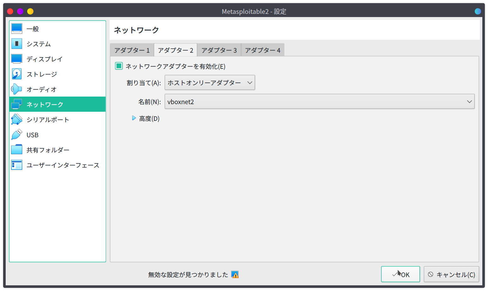

起動したらusernameとpasswordを聞かれますので、どちらも *msfadmin* でログインします。

コンソール画面で以下のコマンドでMetasploitable2のIPアドレスを確認します。
inet addrに続くIPアドレスを確認しておきます。

```bash
$ ifconfig
eth0
(中略)
      inet addr:172.28.128.X  Bcast:172.28.128.255  Mask:255.255.255.0
(中略)
```

ここまで出来ればMetasploitable2の設定は終了です。

## 攻撃用マシンでの作業

### ブラウザの設定

先程確認したIPアドレスをブラウザで開きます。

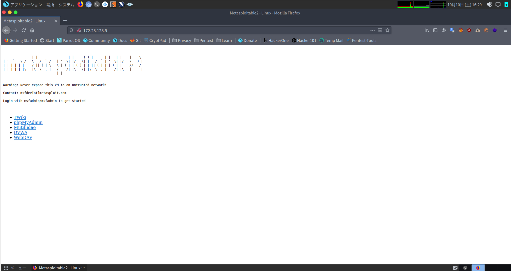

Mutillidaeをクリックします。

MutillidaeとはOWASP Foundationが提供している、意図的に脆弱なWebアプリケーションになります。

次に左のメニューから、OWASP Top 10 => A1 Injection => SQLi Extract Data => User Infoを選択してください。

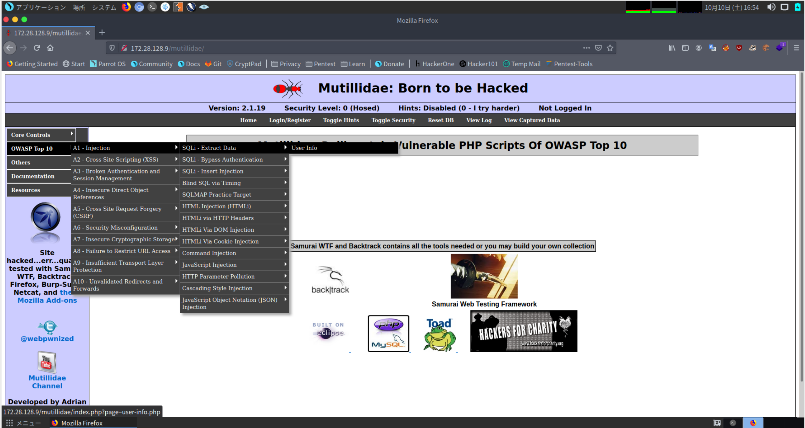

こちらの画面でSQLインジェクションを行っていきます。

## foxyproxyの設定

Firefoxの拡張機能であるfoxyproxyがとても便利なのでそちらでプロキシの設定をしてきます。

FoxyProxyの設定からAddをクリックし、必要な情報を入力していきます。

今回は以下のように設定しました

- Title: Metasploitable2
- Proxy IP: 127.0.0.1
- Port: 8080

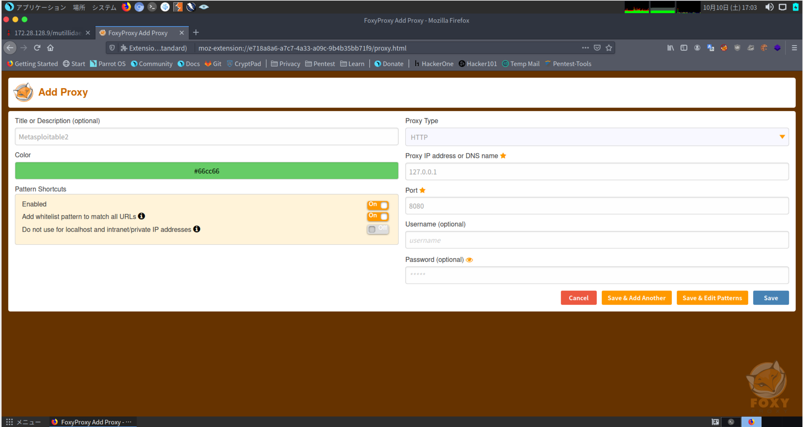

その後、Save & Edit Patternsをクリックし、Metasploitable2のIPアドレスを設定してSaveします。

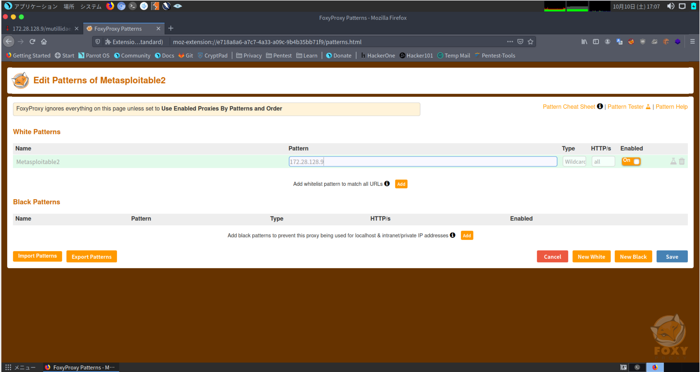

設定が完了したら、先程の画面からMetasploitable2を選択してあげます。

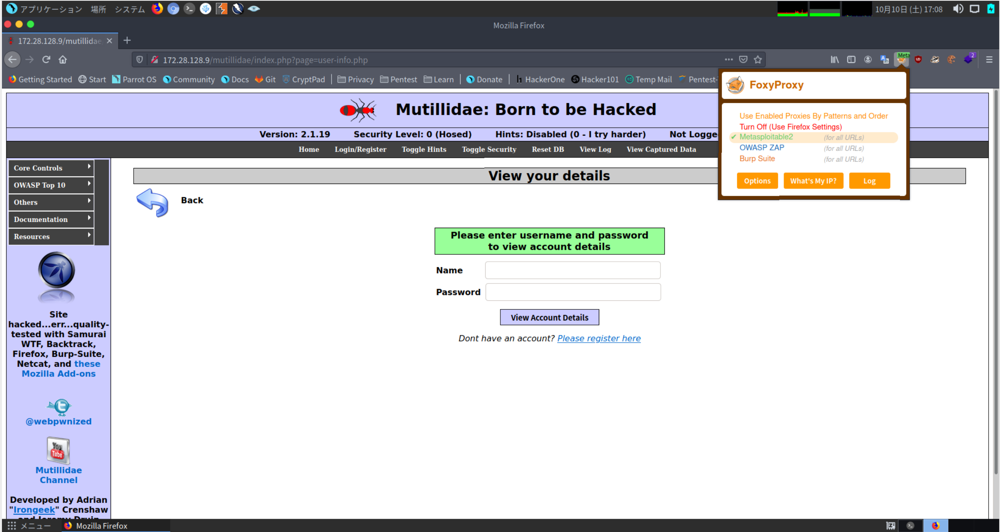

## BurpSuiteの設定

BurpSuiteを開きProxyタブのInterceptをOffにしておきます。

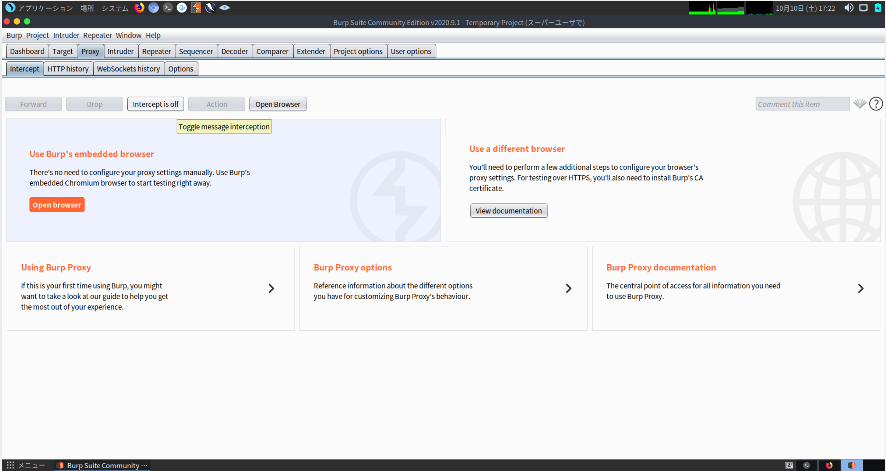

ブラウザをリロードすることで、HTTP historyにきちんと表示されていることを確認してください。

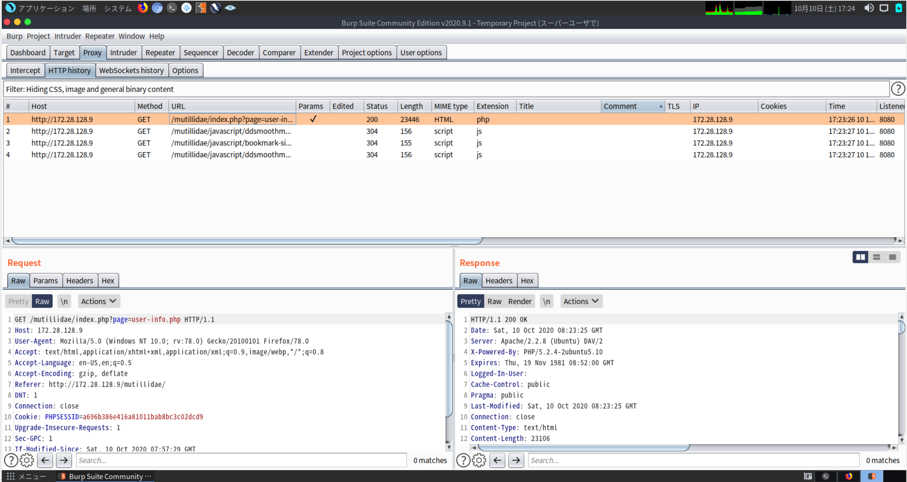

## SQLインジェクション

それでは、実際にブラウザでusername:passwordを入力してみましょう。

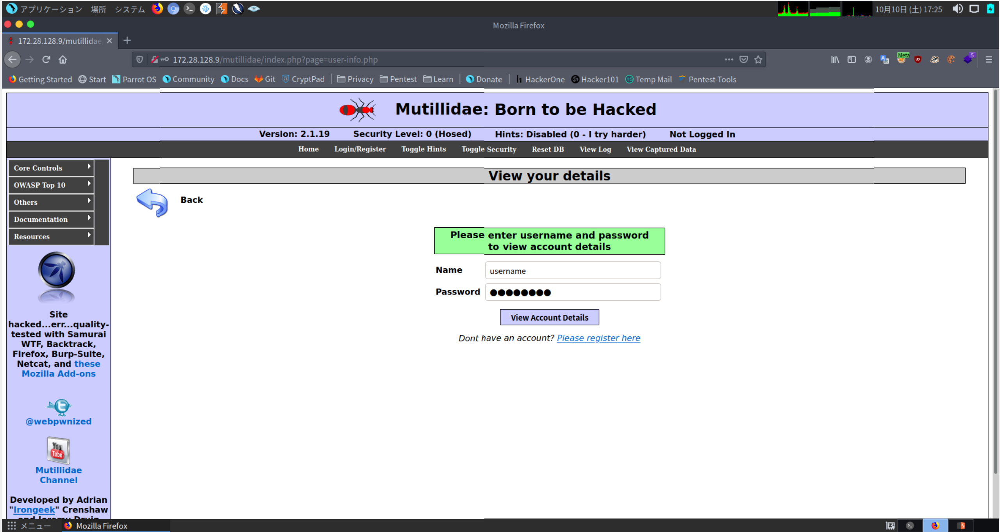

すると、エラー文が表示されたと思います。
今回のWebアプリケーションでは、UsernameとPasswordの組が存在していないとError文が表示される形となっています。

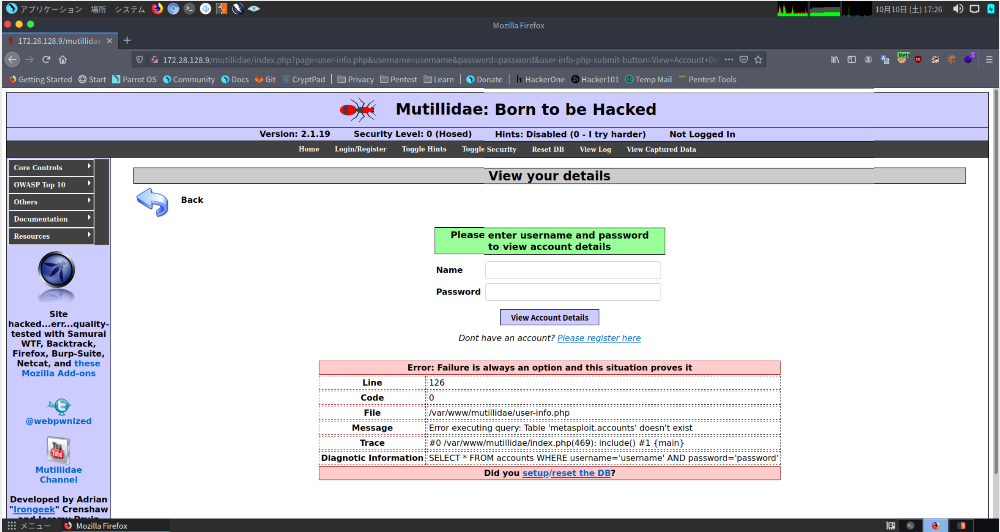

BurpSuiteを開き、usernameとpasswordを入力したものをIntruderに送りましょう。

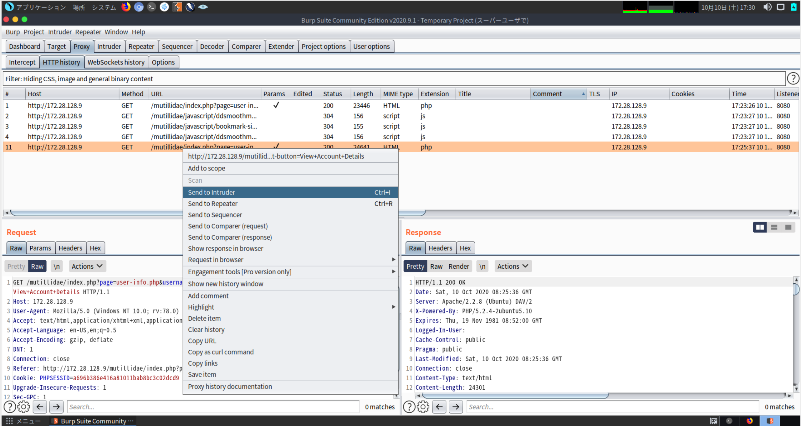

IntruderタブのPositionsにてusernameのみを追加しましょう。
usernameのみ$で囲まれていれば正解です。

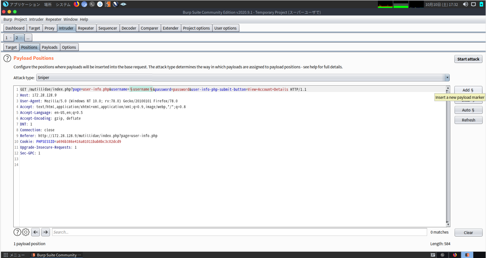

それではwfuzzのwordlistを使っていきましょう。
Parrot Security OSを使用しているのであれば、`/usr/share/wordlists/wfuzz/injections/SQL.txt` というのがあるので、今回はそれを使用していきます。

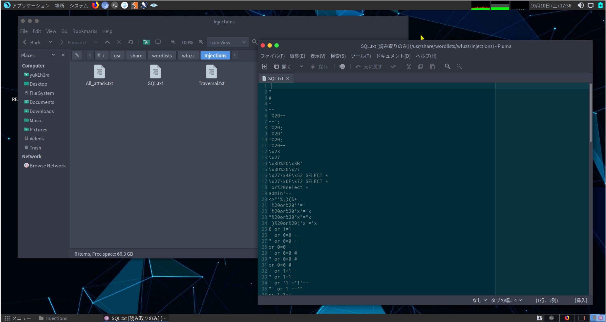

Payloadsタブから、Payloads OptionsのLoadから先程のwordlistを選択してあげます。

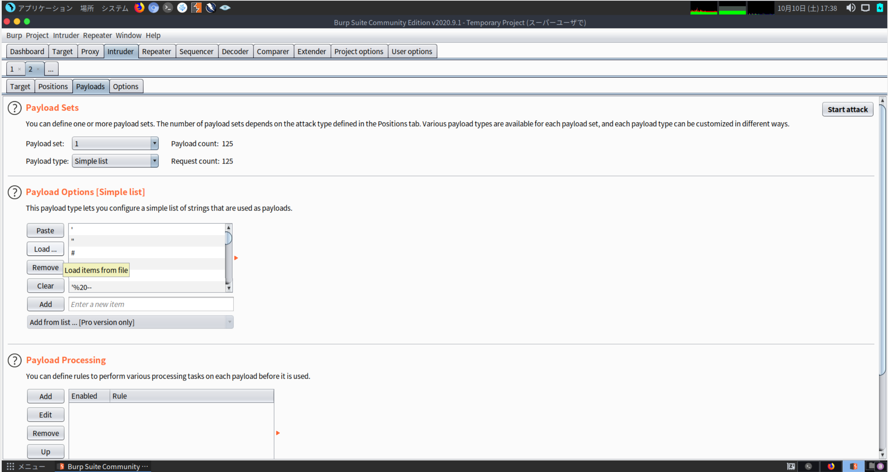

右上のStart Attackをしてあげると順次結果が表示されていきます。

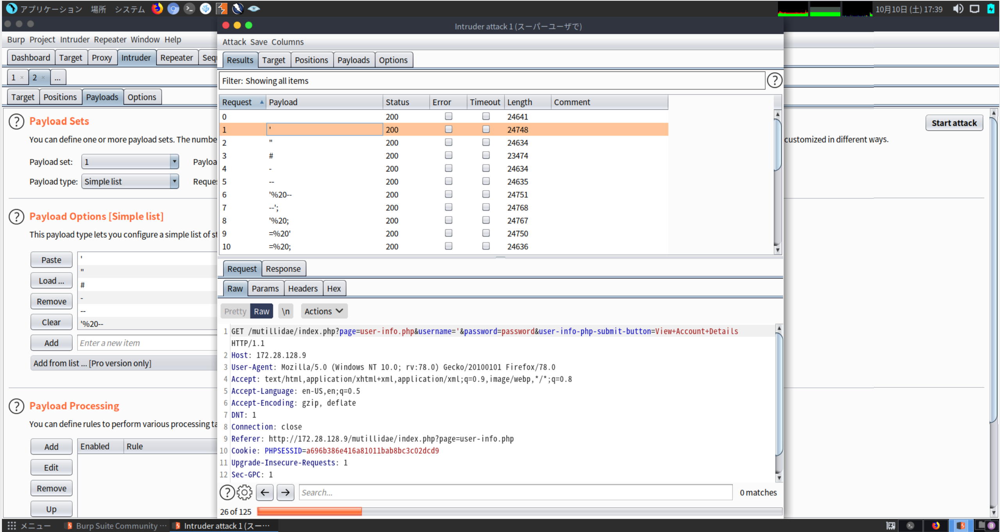

## おわりに

今回はwordlistを用いてBurpSuiteのIntruder機能を使ってSQLインジェクションを行いました。
これによってSQLインジェクションの確認を手打ちでするのではなく、予め用意しておいたものをloadすることで作業効率のアップが見込まれます。

しかし、BugBountyなどでは自動でのリクエストを禁止している場合があるため、ルールをよく読んだ上で実行することを勧めます。
