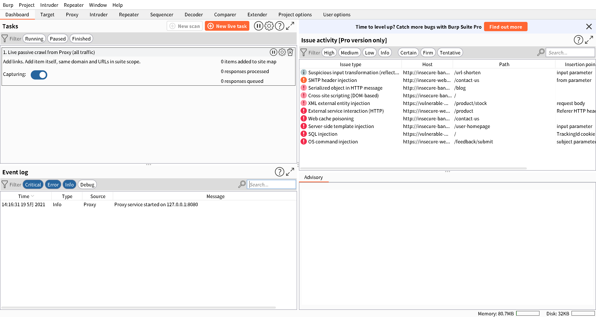
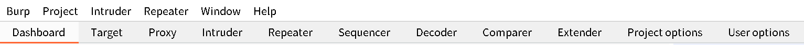
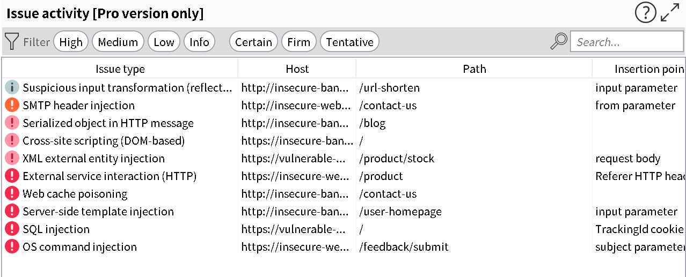
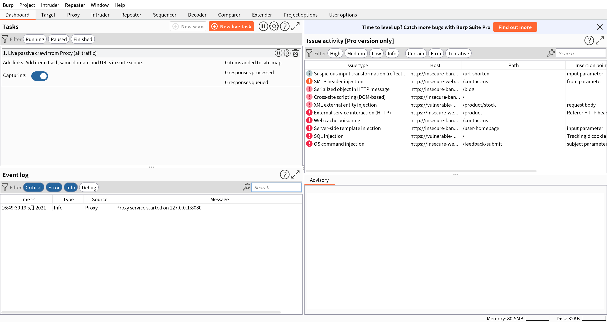
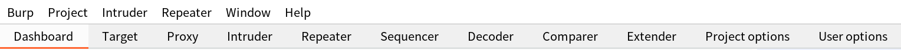
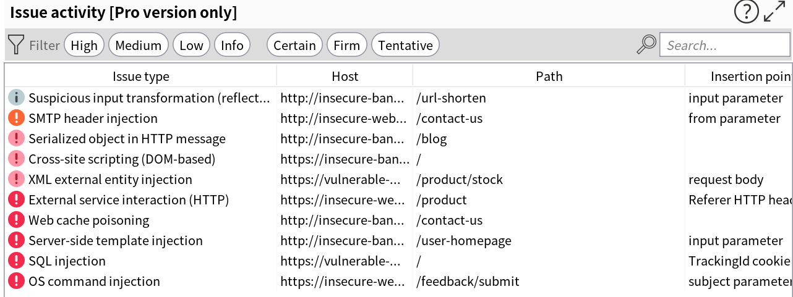

普段プロキシツールであるBurpSuiteを使用していますが、そのフォントがあまりにも汚くとてもじゃないが読めたものじゃない状況でした。
今回は、そんなBurpやZAPなど、Java applicationに関するフォントのアンチエイリアスについての解決方法を紹介します。

## 環境

私の現在の環境は以下の通りです。

> OS: Manjaro Linux
> BurpSuite: v2021.3.3
> Java: OpenJDK Runtime Environment (build 15.0.2+7)

## 問題点

BurpSuiteを立ち上げた際に、フォントが以下のように綺麗に表示されておりませんでした。



特に、タブの部分や、



文字の部分が汚くなっていることが解ると思います。



## 解決方法

天下のArchWikiに解決方法が乗っていました。



フォントのアンチエイリアスについては、`/etc/environment`に追記するだけで済みそうです。

```$:.bash
sudo vim /etc/environment
```

```
#
# This file is parsed by pam_env module
#
# Syntax: simple "KEY=VAL" pairs on separate lines
#
_JAVA_OPTIONS='-Dawt.useSystemAAFontSettings=on'
```

この記述をした後、再起動すれば設定が反映されています。

YouTubeにも同様にして解決している動画があったので添付しておきます。



## 設定反映後

設定反映後の状態を見てみましょう



先程よりも綺麗に表示されていることが分かりますでしょうか？

気になっていたタブやフォントの拡大画像はこちらです。





無事に綺麗なフォントで表示することができました。

## おわりに

普段使っているツールなだけに、アンチエイリアスのかかっていないフォントではやる気が削がれたり、見にくく目が疲れてしまったりします。
こういった少しの手間だけでこんなにも綺麗になり、変なところでストレスを抱えず生産性の向上につながっていくと思います。

最後まで読んでいただきありがとうございます。この記事が誰かの役になったのなら幸いです。