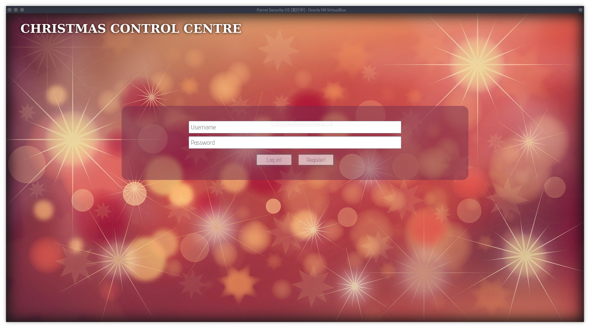
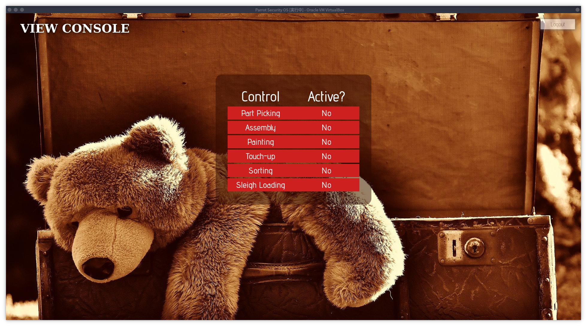
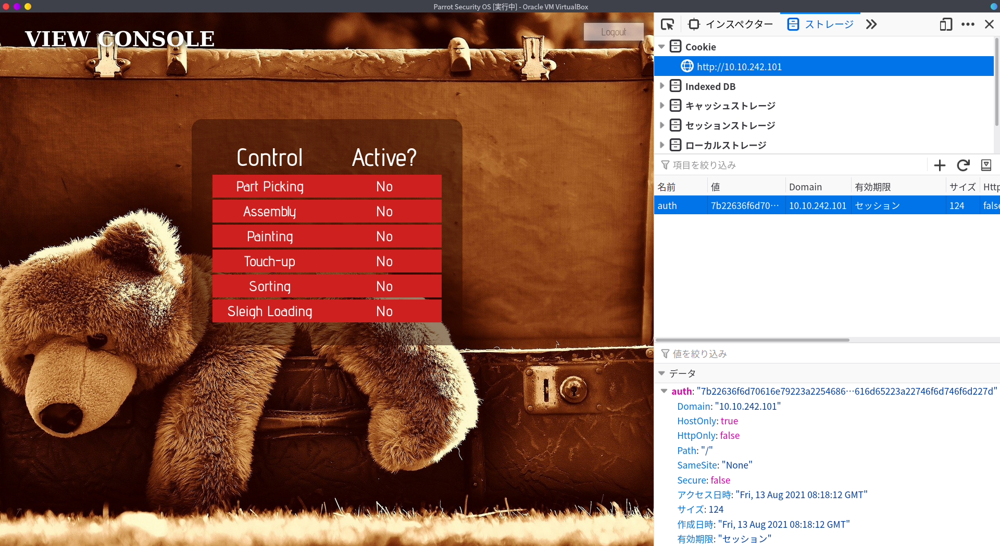
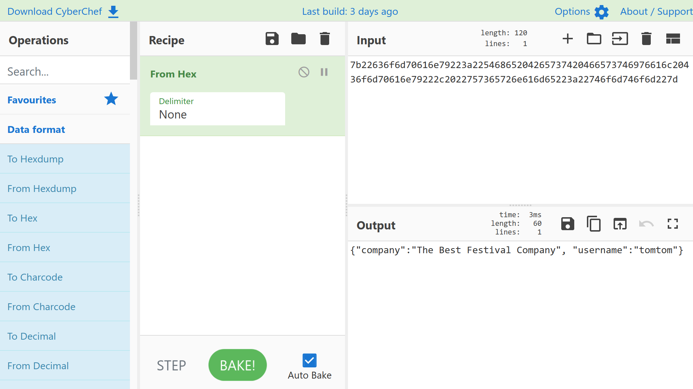
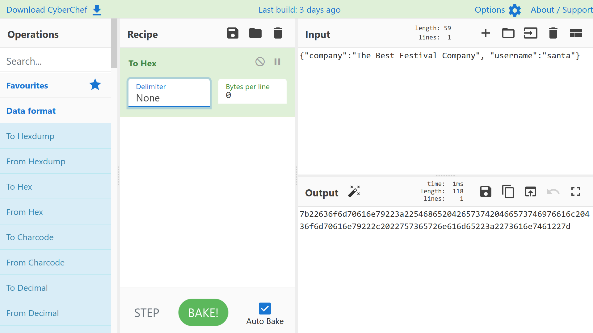
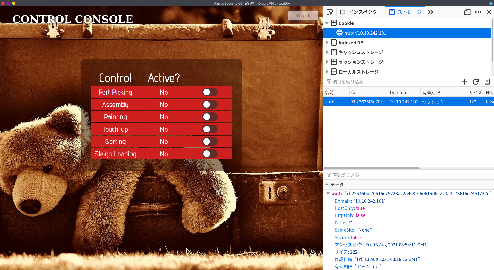

## はじめに

今回からTryHackMeで公開されている[Advent of Cyber 2](https://tryhackme.com/room/adventofcyber2)を解いていきたいと思います。
このRoomではアドベントカレンダーのように12月１日から毎日問題が追加されていくタイプのRoomで、クリスマスまでの全24題出題されます。

問題はBeginnersレベルを対象にしているので、興味がある方は一度解いてみることをオススメします。


本記事は全てのセキュリティに携わる人に向けて執筆しており、クラッキングを推奨するものではありません。本記事の手法を用いて、許可された環境以外で実行することは絶対にやめてください。


## [Day1] A Christmas Crisis

この章では、Webとは何か、HTTP(S)とは何か、Cookieとは何かなど、Webを扱うにあたっての基本的なことを問われています。
特に、認証、セッション管理について重きが置かれています。しかし、聞かれていることは基本的なことなので、Webアプリケーション開発者やCTFに触れたことがない人でも解けるような問題となっています。

まず、ページにアクセスするとこのようなログイン画面が表示されます。

適当なアカウントを作成し、ログインをすると次のような画面になります。

ページの構成はこの２つでしたので、それでは問題を解いていきましょう。

### What is the name of the cookie used for authentication?

> *認証に使用されるCookieの名前は何ですか？*

Cookieについて問われています。`F12`を押してDeveloper Toolsを開き、Cookieを確認しましょう。

Cookieの名前を確認して終了です。

### In what format is the value of this cookie encoded?

> *このCookieの値はどの形式でエンコードされていますか？*

Cookieの値を見ると長い文字列で形成されていることがわかります。エンコード形式を特定できるような特徴的な部分がないか確認したりします。
今回は、[CyberChef](https://gchq.github.io/CyberChef/)というサイトを使って、エンコード形式を特定しました。

### Having decoded the cookie, what format is the data stored in?

> *Cookieをデコードした後、データはどのような形式で保存されますか？*

先程のCyberChefのOutputから、形式を特定しました。

### What is the value of Santa's cookie?

> *SantaのCookieの値は何ですか？

CookieはJSON形式で保存されており、それがhexでエンコードされていました。今度はその逆を行います。
Inputに先程と同じような形式で、usernameをsantaに変更します。その後Hexに変換することで、santaのCookieを取得することができます。

### What is the flag you're given when the line is fully active?

> *ラインが完全にアクティブなときに与えられるフラグは何ですか？*

先程作成したsantaのcookieを、ブラウザのDeveloper Toolsを用いて置き換え、再度ページをリロードすることで、santaとしてログインすることができました。
最初に作成したユーザーでは見られなかったコントロールパネルが表示され、これらを全てオンにすることで最後のフラグをゲットできます。

## おわりに

今回は脆弱なCookieの設定を用いて、他人になりすまし不正ログインする手法でした。
問題としては1時間あれば終わるような問題でしたが、Webアプリケーションを開発していく上で、適切なセッション管理が必要であることを再認識するいい機会になりました。
