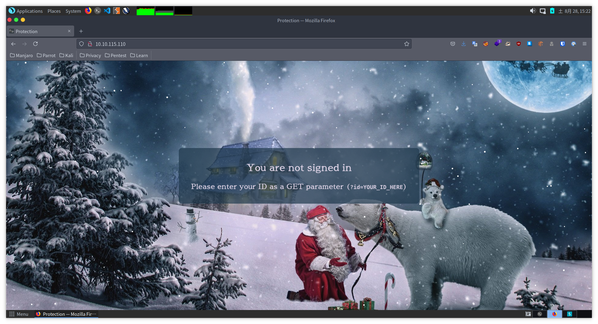
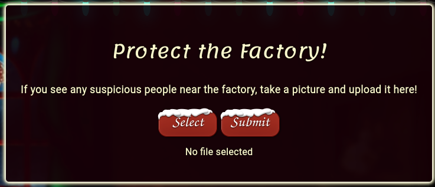
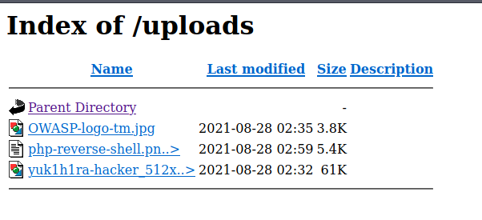
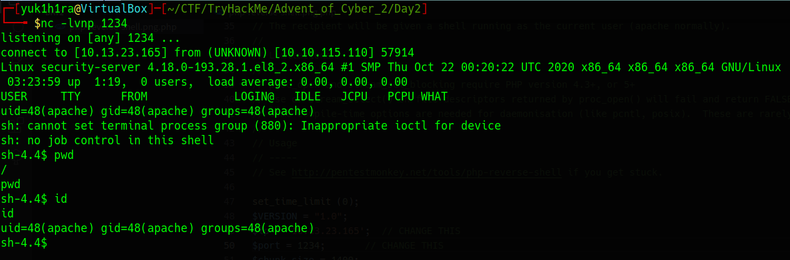

## はじめに

Advent of Cyber 2の2日目です。
今回も基本的なWeb問題なため、CTF初心者の方でもとっつきやすいと思います。
CTFが全くわからない方にも分かるように詳しく書いているので、是非自分で解いてみる事をオススメします。

**それでは、解いていきましょう。**


本記事は全てのセキュリティに携わる人に向けて執筆しており、クラッキングを推奨するものではありません。本記事の手法を用いて、許可された環境以外で実行することは絶対にやめてください。


## The Elf Strikes Back!

最初にアクセスすると以下のようなページが表示されます。



では問題を解いていきましょう。

### What string of text needs adding to the URL to get access to the upload page?

> アップロードページにアクセスするには、URLにどの文字列を追加する必要がありますか？

トップページには、`Please enter your ID as a GET parameter (?id=YOUR_ID_HERE)`とあるので、URLにIDを追加してみると無事アップロードページにアクセスすることができました。



### What type of file is accepted by the site?

> サイトではどのような種類のファイルが受け入れられますか？

ページには`If you see any suspicious people near the factory, take a picture and upload it here!`とあるので、画像イメージをアップロードすることができます。

### Bypass the filter and upload a reverse shell.

> フィルタをバイパスし、リバースシェルをアップロードします。

今回のサイトでは、png形式やjpg形式のみアップロードを受け入れているため、それを回避する方法を考えます。
今回はファイル名を少し修正して、意図した形式以外のファイルのアップロードを試みます。

```bash
cp /usr/share/webshells/php/php-reverse-shell.php ~/CTF/TryHackMe/Advent_of_Cyber_2/Day2/
mv php-reverse-shell.php php-reverse-shell.png.php
```

そして、php-reverse-shell.png.phpのコード上にあるIPアドレス/Port番号を書き換え、ファイルのアップロードをして準備完了です。
ファイルのアップロードに関するCTFのテクニックについては、以下のRoomが参考になります。



### In which directory are the uploaded files stored?

> アップロードされたファイルはどのディレクトリに保存されますか？

ディレクトリサーチの時間です。隠されたディレクトリを探す時にブルートフォースアタックをして探していきます。
今回は`gobuster`というツールを使って隠されたディレクトリを探しました。

```bash
gobuster dir -u http://10.10.XXX.XXX -w /usr/share/wordlists/dirbuster/directory-list-2.3-medium.txt --wildcard
```

正しいディレクトリを探し当てた時に、無事に`php-reverse-shell.png.php`がアップロードされていることが確認できます。



### Activate your reverse shell and catch it in a netcat listener!

> リバースシェルをアクティブにして、netcatリスナーでキャッチしてください！

自分で設定したポート番号を使って、`nc`コマンドで待機しておきます。

```bash
nc -lvnp XXXX
```

その後、ブラウザでアップロードしたファイルをクリックし、Terminal上でshellを奪取できたことを確認します。



### What is the flag in /var/www/flag.txt?

> /var/www/flag.txtのフラグは何ですか？

`cat`コマンド等で確認して終了です。

## おわりに

今回はファイルのアップロードがあるサイトから、フィルタリングの脆弱性をついてシェルを奪取するCTFでした。
Webアプリケーション開発者はファイルの拡張子の適切なフィルタリング設定をすることが大切です。
