## はじめに

Day3では、認証について、デフォルト設定の危険性についてが主な題材となっています。

認証とは、一般的にユーザーIDやパスワード等を用いて、実際に本人であるかを確認する手法です。
攻撃者はこの認証をどうにかして突破したいと考えており、今回は認証情報によく使われるリストを用いて突破する方法を紹介しています。

**それでは、Day3を解いていきましょう。**


本記事は全てのセキュリティに携わる人に向けて執筆しており、クラッキングを推奨するものではありません。本記事の手法を用いて、許可された環境以外で実行することは絶対にやめてください。


## Christmas Chaos

最初にTopページにアクセスすると、次のような画面が表示されます。

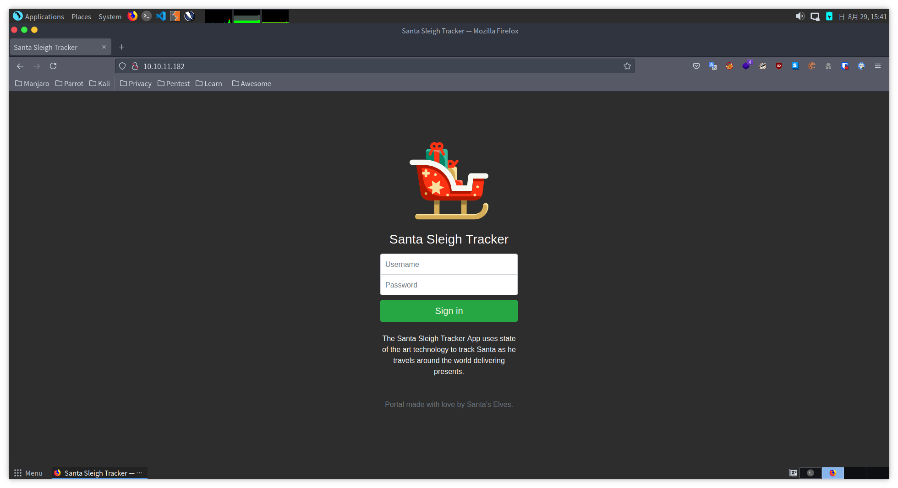

今回は、プロキシツールである**Burp Suite**を使って、辞書攻撃を仕掛ける問題となっています。

Kali LinuxやParrot Security OSを使用している場合はデフォルトでインストールされているため、そのまま立ち上げます。

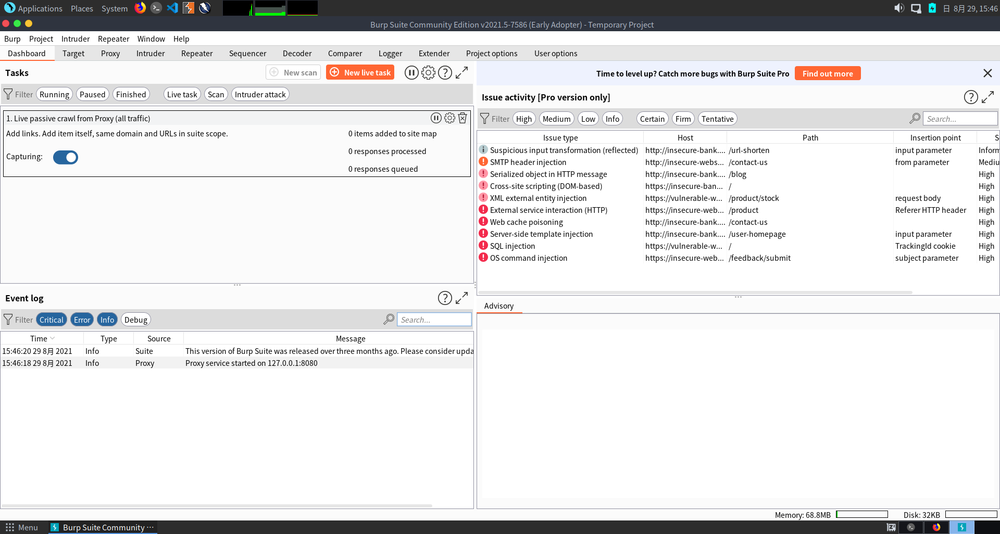

Burp Suiteはデフォルトで`127.0.0.1:8080`になっています。

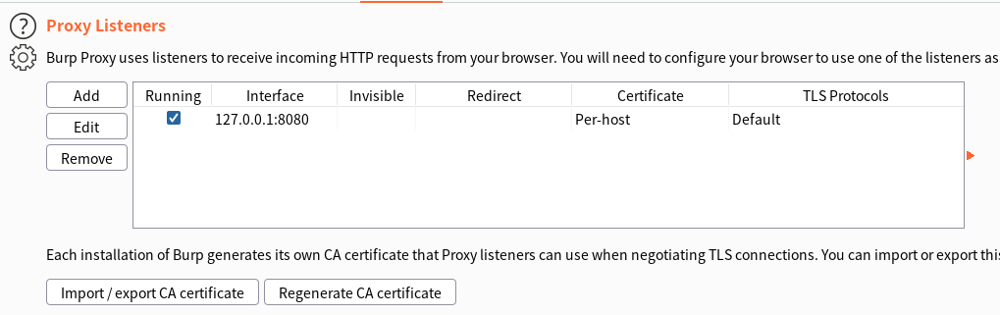

それでは、FoxyProxyの設定をしていきます。

FirefoxのアドオンのFoxyProxyをインストールした後に、以下の画像のOptionから設定していきます。

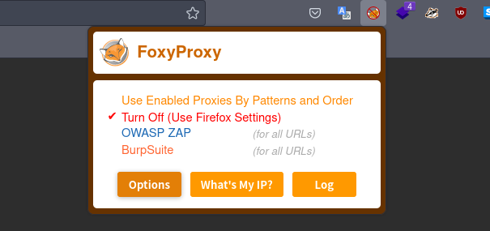

Optionを押した後は以下の画像のようになるので、左上の`Add`から新しい設定を追加します。

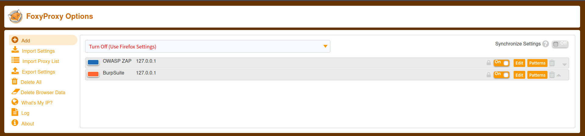

Nameを好きな名前、IPアドレス/PortをBurpSuiteの設定に記載されているものに設定し、Saveで保存します。

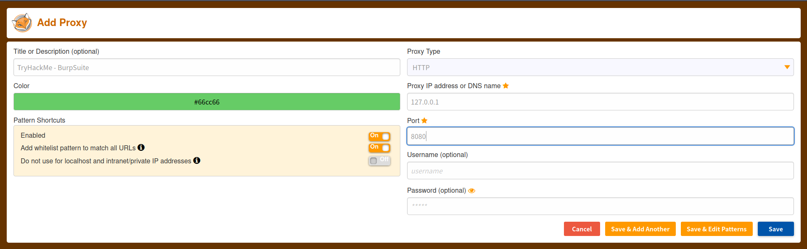

無事、新しい設定が表示されていることがわかります。

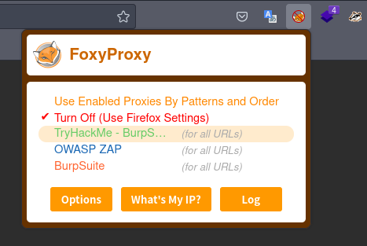

では、FoxyProxyで設定したものを選択し、[http://burpsuite](http://burpsuite)にアクセスします。

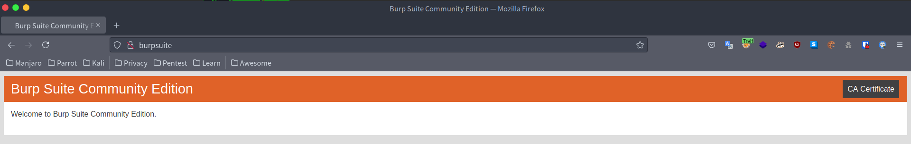

右上のCA Certificateをクリックし、証明書をダウンロードします。

ダウンロードした証明書をブラウザにインポートしていきます。
Firefoxの設定から、`プライバシーと設定->証明書->証明書を表示`と進んでいき、先程ダウンロードした証明書をインポートしていきます。

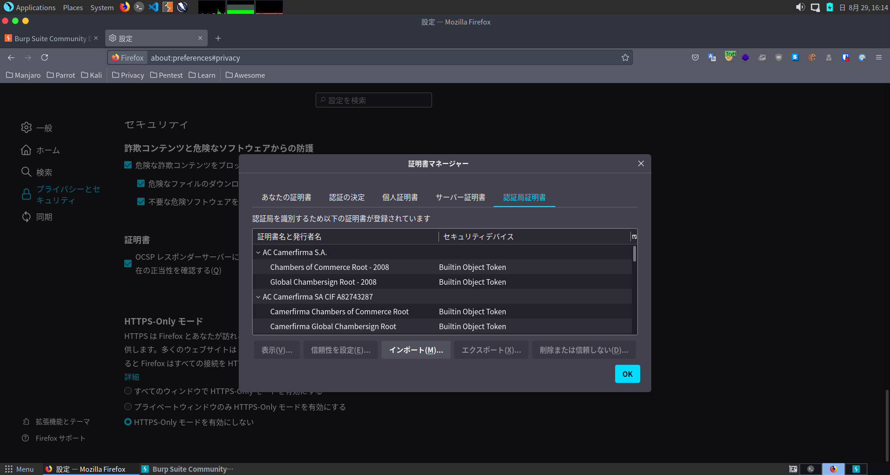

これで、設定は完了です。
正しく設定できていれば、BurpSuiteで確認することができます。

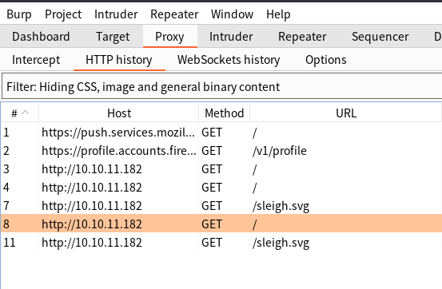

しかし、このままでは意図していないリクエストも表示されてしまうため、フィルタリングをすることで見やすくしていきます。

BurpSuiteのTarget->Site mapから、今回のホストを右クリックし、Add to scopeを選択してあげます。

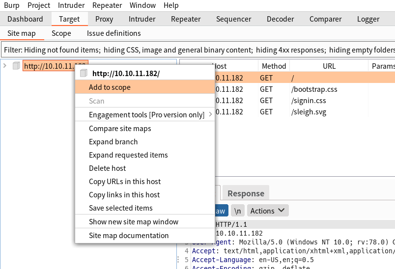

その後、Proxy->Http historyから、`Filter: Hiding CSS, image and general binary content`をクリックし、`Show only in-scope items`にチェックをいれることで、ターゲットのリクエストのみを抽出することができます。

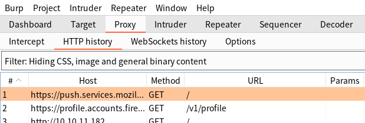

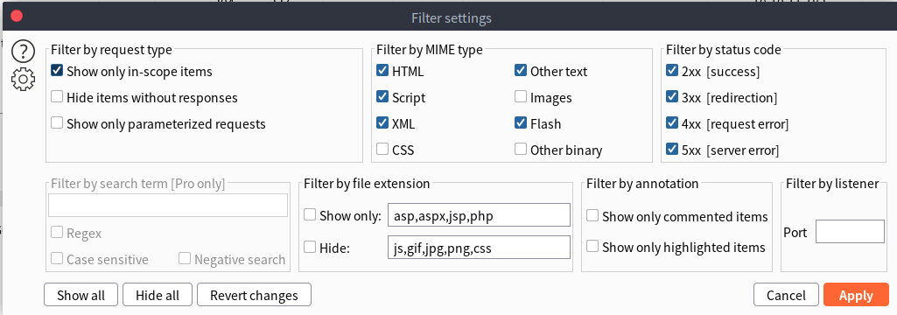

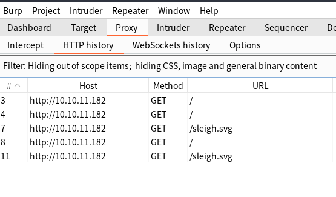

あとは、TryHackMeに記載されている通りにやればフラグはゲットできます。

## おわりに

今回はほとんどCTFの解説をすることがなかったので、BurpSuiteの設定方法を詳しく説明しました。
自分も最初はBurpSuiteの設定方法がうまく出来ず、苦労した経験があったので詰まりそうな部分を詳しく記載いたしました。

CTFを始めてみたけど、設定から躓いてしまう人がいましたら、是非この記事を参考にしてみてください。
