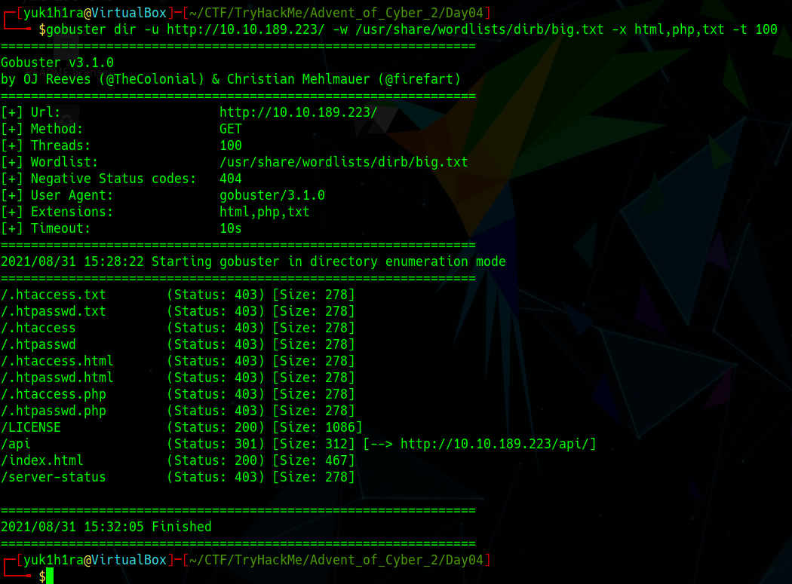

## はじめに

今回はwordlistを使って、ファジング/ブルートフォースをする章になります。
ファジングやブルートフォースによく使われるツールの使い方の説明、実際にそれを使ってみるいい機会になります。

**それでは解いていきましょう**


本記事は全てのセキュリティに携わる人に向けて執筆しており、クラッキングを推奨するものではありません。本記事の手法を用いて、許可された環境以外で実行することは絶対にやめてください。


## Santa's watching

### Given the URL "http://shibes.xyz/api.php", what would the entire wfuzz command look like to query the "breed" parameter using the wordlist "big.txt" (assume that "big.txt" is in your current directory)

> URL「<http://shibes.xyz/api.php>」が与えられた時、ワードリスト「big.txt」を使用して「breed」パラメータをクエリすると、wfuzzコマンドはどのようになりますか。（「big.txt>」が現在のディレクトリ配下を推定）

これは「<http://shibes.xyz/api.php>」に対して、「breed」パラメータに「big.txt」を使用したwfuzz>>コマンドを問われています。
wfuzzコマンドの使い方を理解していますか？という問題ですね。

この問題が分からない場合は問題文をよく読み、wfuzzのヘルプを参照したりすると良いと思います。


実際に「<http://shibes.xyz/api.php>」に対して、
このコマンドを**実行しないでください**


### Use GoBuster (against the target you deployed -- not the shibes.xyz domain) to find the API directory. What file is there?

> デプロイしたターゲットに対して、GoBusterを使用してAPIディレクトリを見つけます。どのファイルがありますか？

今回もディレクトリサーチの時間です。
gobusterコマンドを使用して、(隠された)APIディレクトリを探していきます。

`big.txt`に含まれるワードリストは膨大なため、`-t`オプションを使って高速に処理を進めています。

```bash
gobuster dir -u http://10.10.XXX.XXX/ -w /usr/share/wordlists/dirb/big.txt -x html,php,txt -t 100
```



無事ディレクトリを発見することが出来ました。
APIディレクトリのファイル名が答えになります。

### Fuzz the date parameter on the file you found in the API directory. What is the flag displayed in the correct post?

> APIディレクトリで見つけたファイルに「date」パラメータでファジングします。正しい投稿に表示されるフラグは何ですか？

前２問の解答を応用して答える問題のようです。
wfuzzの使い方、隠されたファイルの列挙が出来ていれば答えられます。

ここでファジングに使うwordlistも提供されているので、予めダウンロードしておきます。

```bash
wfuzz -c -z file,wordlist http://10.10.XXX.XXX/api/site-log.php?date=FUZZ
```

実行すると、一つだけAPIから値が帰ってきているパラメータを発見できます。
ブラウザでそのパラメータで確認するとFlagがゲット出来ます。

## おわりに

今回はディレクトリサーチをする`gobuster`、ファジングツールである`wfuzz`を使ってフラグの奪取をする方法を学びました。
基本的な使い方がわかっていれば30分程度で終わる内容となっていました。

TryHackMeの本文では、ブルートフォースとファジングは違うと記載されていましたが、自分にはその違いがあまりよく分かっていません。
調べたところ、以下のRedditがありましたが、今回に関してはファジングというのかブルートフォースというのかという問題が残っています。



どなたか違いが分かる方がいらっしゃいましたら、教えていただけると幸いです。
