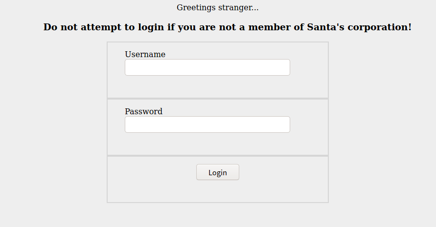
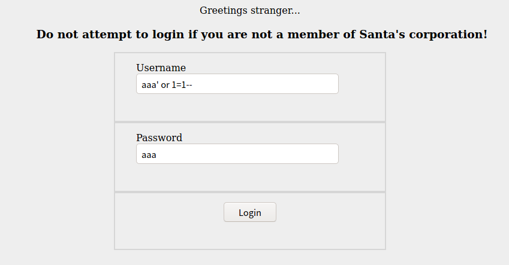
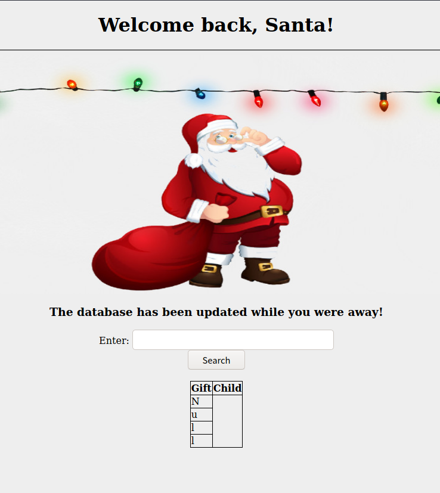
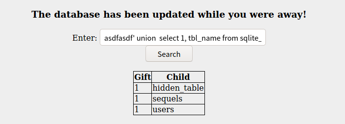
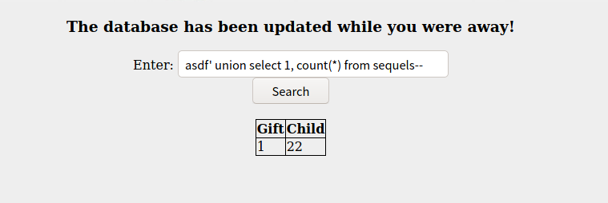
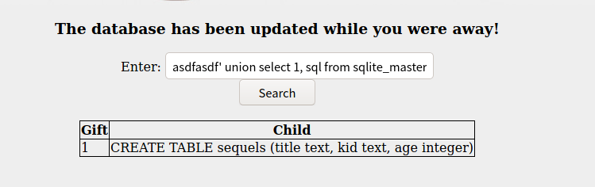
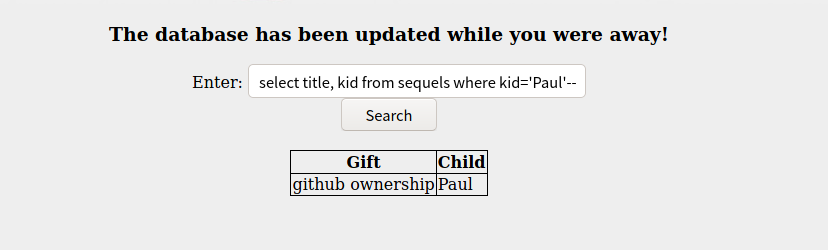

## はじめに

今回はSQLインジェクションを使った章になります。
UNIONを使ってデータベースの中身を見ていく基本的な内容ですが、日頃から取り組んでいないとついつい忘れてしまいがちな項目になると思います。
SQLインジェクションという基本的な脆弱性の問題のため、いい復習の機会になると思います。


本記事は全てのセキュリティに携わる人に向けて執筆しており、クラッキングを推奨するものではありません。本記事の手法を用いて、許可された環境以外で実行することは絶対にやめてください。


## Someone stole Santa's gift list!

### Without using directory brute forcing, what's Santa's secret login panel?

> ディレクトリのブルートフォースを使わずに、サンタの秘密のログインパネルを教えてください。

ブルートフォースを使わずにということで、ログイン画面に遷移しそうなURLを推測する問題です。
Webページから使用されそうな単語をとりあえず突っ込んでみたりするのがいいですが、今回のSQLインジェクションにはあまり問題ではないため、ある程度試してみたらヒントをみて回答しました。

### Visit Santa's secret login panel and bypass the login using SQLi

> サンタの秘密のログインパネルにアクセスし、SQLiを使ってログインをバイパスする

先程の隠されたログインパネルにアクセスすると、UsernameとPasswordを入力するログイン画面が表示されました。



ここで、適当にSQLインジェクションをしてみます。



無事ログインできました。



### How many entries are there in the gift database?

> giftデータベースにはいくつのエントリがありますか？

検索ボックスに`a`や`1`などの適当なものを入れてみると、検索ボックスに含まれた文字列をLIKE演算子を持ちいて探してくることが推測されます。

使われているデータベースを調べていくと、SQLiteが使われていることが分かったので、必要な情報を列挙していきます。

まずは、テーブルの名前を取得します。

```SQL
asdfasdf' UNION SELECT 1, tbl_name FROM sqlite_master  --
```

実行すると以下の結果になります。



sequelsテーブルに対して、カウントで数を数えあげれば終了です。

```SQL
asdf' UNION SELECT 1, COUNT(*) FROM sequels--
```



### What did Paul ask for?

> パウロは何を求めましたか？

先程の`sequels`のカラムを確認していきます。
Payloadsは[PayloadsAllTheThings](https://github.com/swisskyrepo/PayloadsAllTheThings/blob/master/SQL%20Injection/SQLite%20Injection.md#integerstring-based---extract-column-name)を参考にしています。

```SQL
asdfasdf' UNION SELECT 1, sql FROM sqlite_master WHERE type != 'meta' AND sql NOT NULL AND name = 'sequels'--
```

実行すると以下の結果になります。



以上の結果から、sequelsのカラムには、`title`, `kid`, `age`の3つがあることがわかりました。

よって、Paulが求めているGiftは以下のように求めます。

```SQL
asdf' UNION SELECT title, kid FROM sequels WHERE kid='Paul'--
```



### What is the flag?

> flagは何ですか？

先程と同様のことをやるだけです。

### What is admin's password?

> adminのパスワードは何ですか？

こちらも同様にカラムの列挙をし、表示させて終了です。

## おわりに

今回はSQLインジェクションを用いてデータベースの内容を読み取るという問題でした。
WriteUPを書きながら解いていった結果、2時間ほどで全ての問題に回答することができました。
問題文にもあったように、**sqlmap**を用いるとより簡単にできるのですが、今回のWriteUPでは実際に愚直に解いていきました。
一通りとき終わったあとに、sqlmapを使って解いてみるというのが1番勉強になるかと思います。
