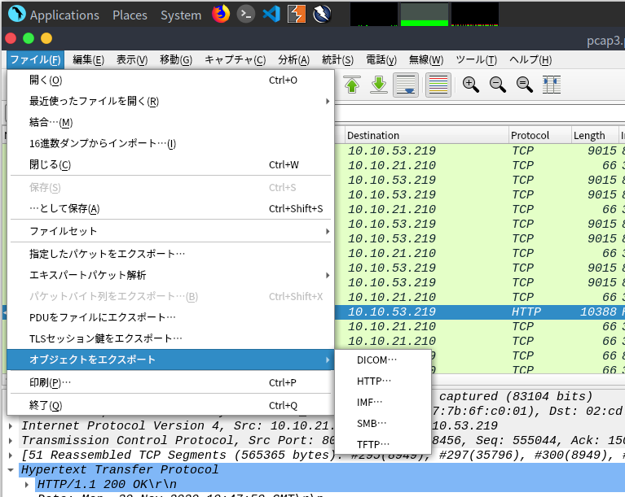

## はじめに

今回はIPアドレスとは、プロトコルとは、TCP/UDPとは、ということをWiresharkというパケットキャプチャツールを通して学べる章になります。



本記事は全てのセキュリティに携わる人に向けて執筆しており、クラッキングを推奨するものではありません。本記事の手法を用いて、許可された環境以外で実行することは絶対にやめてください。


## The Grinch Really Did Steal Christmas

### Open "pcap1.pcap" in Wireshark. What is the IP address that initiates an ICMP/ping?

> Wiresharkで「pcap1.pcap」を開いてみてください。ICMP/pingを開始するIPアドレスは何ですか？

WiresharkからICMPパケットを送信しているIPアドレスを回答して終わりです。
Wiresharkでは、ある特定のプロトコルのみを表示させたい場合は、画面上部の「表示フィルター」でプロトコル名を指定してあげることで、それ以外のパケットを非表示にすることができます。

### If we only wanted to see HTTP GET requests in our "pcap1.pcap" file, what filter would we use?

> 「pcap1.pcap」ファイルにHTTP GETリクエストだけを表示させたい場合、どのようなフィルタを使用すればよいのでしょうか？

Wiresharkの検索フィルタについてです。
httpプロトコルのGETのみ表示させたいため、以下のようにフィルタリングしてあげます。

```
http.request.method == GET
```

### Now apply this filter to "pcap1.pcap" in Wireshark, what is the name of the article that the IP address "10.10.67.199" visited?

> では、このフィルターをWiresharkの「pcap1.pcap」に適用すると、IPアドレス「10.10.67.199」が訪れた記事名は何でしょうか。

先程のフィルターを適用し、パケットの中身を確認します。
Webアプリケーションを作成したことがある方などはURLから推測することができると思います。

### Let's begin analysing "pcap2.pcap". Look at the captured FTP traffic; what password was leaked during the login process?

> では、「pcap2.pcap」の解析を始めてみましょう。キャプチャされたFTPトラフィックを見てください。ログインプロセスでどのようなパスワードが漏れたのでしょうか？

Wiresharkでpcap2.pcapを開いて、FPTトラフィックをフィルタリングしてみます。
眺めていると、`Login incorrect`などと今回の問題に関連しそうなワードが見つかると思いますので、その前後を確認することでflagをゲットできます。

### Continuing with our analysis of "pcap2.pcap", what is the name of the protocol that is encrypted?

> 「pcap2.pcap」の解析の続きですが、暗号化されているプロトコルの名前は何でしょうか？

プロトコルの基本的な問題です。
pcap2の後半ではsshで通信していることが見て取れます。

### Analyse "pcap3.pcap" and recover Christmas! What is on Elf McSkidy's wishlist that will be used to replace Elf McEager?

> 「pcap3.pcap」を解析してクリスマスを取り戻せ！？Elf MacEagerの代わりとなる、Elf McSkidyのウィッシュリストには何があるのか？

パケットを見ていると、httpリクエストで`/christmas.zip`というパケットが見つかると思います。
こちらにあたりをつけ、christmas.zipをなんとか取得しようと試みます。

Wiresharkでは、オブジェクトのエクスポート機能があるためそちらを使用します。



上記の画像のように、HTTPを選択することでchristmas.zipを取得できました。

こちらのzipファイルを解凍し、flagをゲットします。

## おわりに

今回はWiresharkを使ってパケットを見ていくことをしました。
基本的なWiresharkの使い方が多かったので、Wiresharkになれていない方にはいい勉強になるかと思います。
