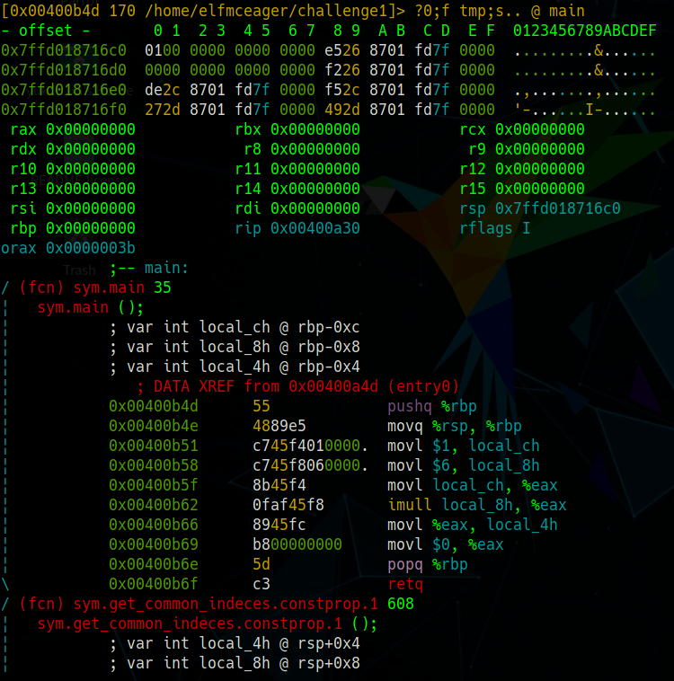
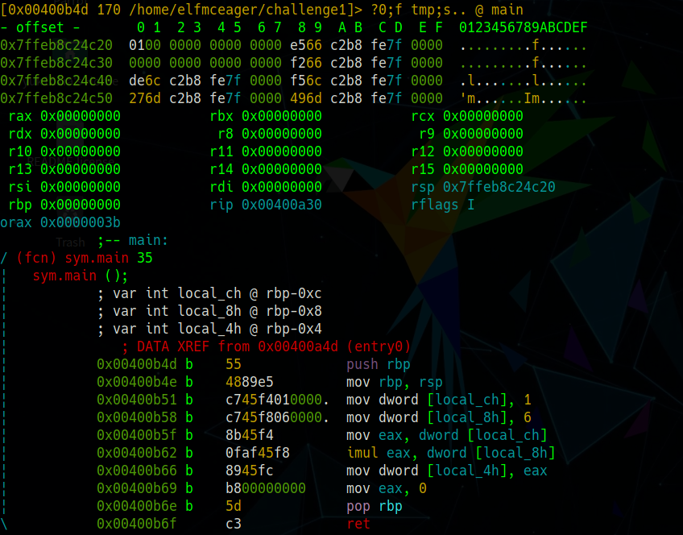
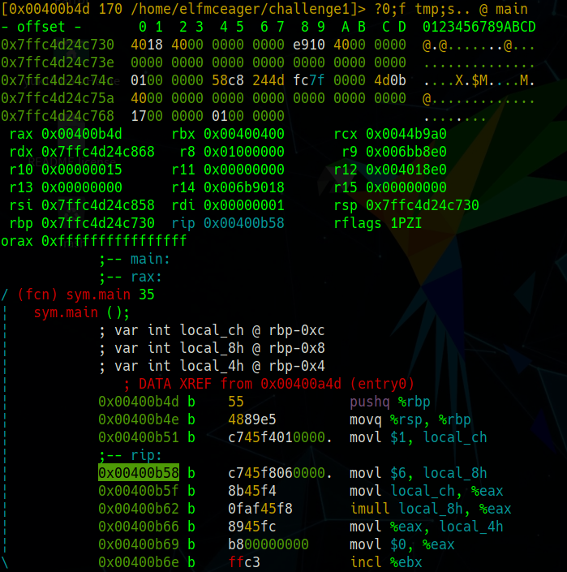
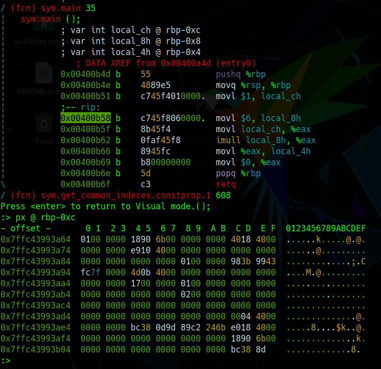
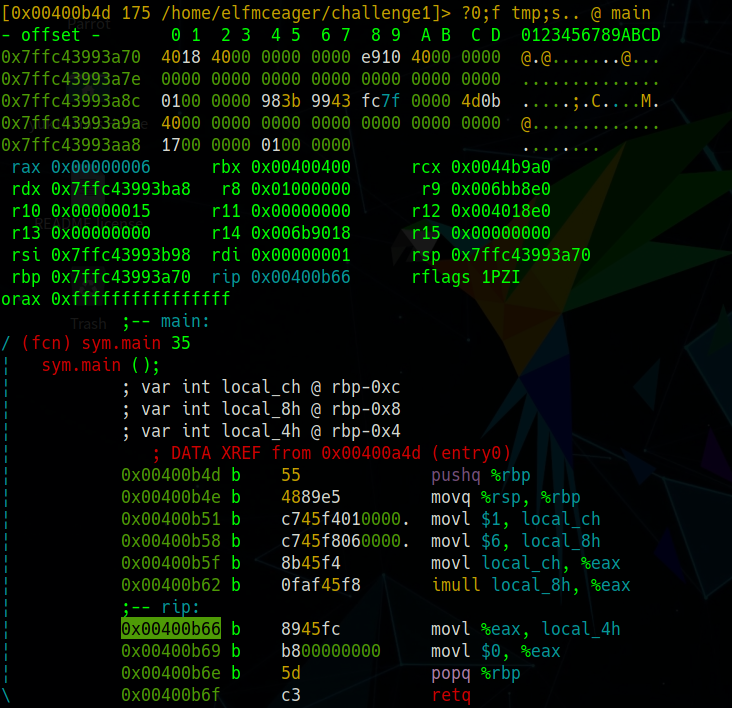
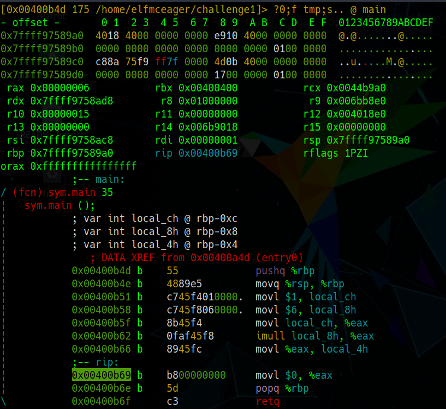
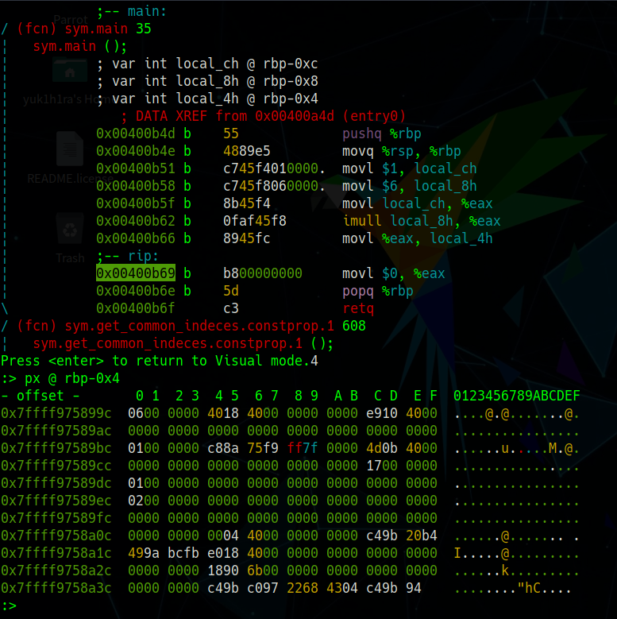

## はじめに

TryHackMeのAdvent of Cyber 2 Day17のWriteUPです。



今回は[radare2](https://github.com/radareorg/radare2)を使ったバイナリ解析の章になっています。


本記事はすべてのセキュリティに携わる人に向けて執筆しており、クラッキングを推奨するものではありません。本記事の手法を用いて、許可された環境以外で実行することは絶対にやめてください。


## ReverseELFneering

まずはradare2でデバッグモードでchallenge1を開きます。

```bash
r2 -d ./challenge1
```

radare2で開いたらまずは解析させることが一般的です。`aa`コマンドで解析させます。

```bash
[0x00400a30]>aa
```

解析が終わったら、`afl`コマンドで関数の一覧を表示させます。**a**nalyse **f**unctions **l**istと覚えます。

```bash
[0x00400a30]> afl
```

大量に関数が出てきたので、`grep`してあげます。

```bash
[0x00400a30]> afl | grep main
0x00400b4d    1 35           sym.main
0x00400de0   10 1007 -> 219  sym.__libc_start_main
0x00403840   39 661  -> 629  sym._nl_find_domain
0x00403ae0  308 5366 -> 5301 sym._nl_load_domain
0x00415ef0    1 43           sym._IO_switch_to_main_get_area
0x0044ce10    1 8            sym._dl_get_dl_main_map
0x00470430    1 49           sym._IO_switch_to_main_wget_area
0x0048f9f0    7 73   -> 69   sym._nl_finddomain_subfreeres
0x0048fa40   16 247  -> 237  sym._nl_unload_domain
```

ここで、main関数がどうなっているのか確認します。

`pdf`コマンドで確認しましょう。**p**rint **d**isassembly **f**unctionと覚えます。

```bash
[0x00400a30]> pdf @main
            ;-- main:
/ (fcn) sym.main 35
|   sym.main ();
|           ; var int local_ch @ rbp-0xc
|           ; var int local_8h @ rbp-0x8
|           ; var int local_4h @ rbp-0x4
|              ; DATA XREF from 0x00400a4d (entry0)
|           0x00400b4d      55             push rbp
|           0x00400b4e      4889e5         mov rbp, rsp
|           0x00400b51      c745f4010000.  mov dword [local_ch], 1
|           0x00400b58      c745f8060000.  mov dword [local_8h], 6
|           0x00400b5f      8b45f4         mov eax, dword [local_ch]
|           0x00400b62      0faf45f8       imul eax, dword [local_8h]
|           0x00400b66      8945fc         mov dword [local_4h], eax
|           0x00400b69      b800000000     mov eax, 0
|           0x00400b6e      5d             pop rbp
\           0x00400b6f      c3             ret
```

インテル記法のアセンブリが表示されています。
AT&T記法に変更する場合は以下のコマンドで変更できます。

```bash
[0x00400a30]> e asm.syntax=att
[0x00400a30]> pdf @main
            ;-- main:
/ (fcn) sym.main 35
|   sym.main ();
|           ; var int local_ch @ rbp-0xc
|           ; var int local_8h @ rbp-0x8
|           ; var int local_4h @ rbp-0x4
|              ; DATA XREF from 0x00400a4d (entry0)
|           0x00400b4d      55             pushq %rbp
|           0x00400b4e      4889e5         movq %rsp, %rbp
|           0x00400b51      c745f4010000.  movl $1, local_ch
|           0x00400b58      c745f8060000.  movl $6, local_8h
|           0x00400b5f      8b45f4         movl local_ch, %eax
|           0x00400b62      0faf45f8       imull local_8h, %eax
|           0x00400b66      8945fc         movl %eax, local_4h
|           0x00400b69      b800000000     movl $0, %eax
|           0x00400b6e      5d             popq %rbp
\           0x00400b6f      c3             retq
```

`s`コマンドでmain関数に移動したいと思います。

```bash
[0x00400a30]> s main
[0x00400b4d]>
```

現在のアドレスが書き換わっていることが確認できます。

`V`でVisual Modeに移動し、`p`を押すことで表示モードを変更させます。
自分はレジスタやアセンブリが表示されているモードが好きです。



`F2`を押すとブレークポイントを設置できます。



`s/F7`でStep, `S/F8`でStep Overです。

### What is the value of local_ch when its corresponding movl instruction is called (first if multiple)?

> 対応するmovl命令が呼び出されたとき（複数ある場合は最初に）、local_chの値はどうなりますか？

普通にアセンブリを読んでもいいですが今回はせっかくradare2を使っているので、使い方も兼ねて説明してきます。

radare2では`rip`と表示されている場所にいます。

最初にmovl命令が呼び出されたときまで進めていきます。

`s/S`で進めてもよいですし、`:dc`でブレークポイントまで進めることもできます。



`:px @ rbp-0xc`でlocal_chの値を確認できたら、それが答えです。



### What is the value of eax when the imull instruction is called?

> imull命令が呼び出されたときのeaxの値は何ですか？

これも先程とどうようにimull命令が呼び出された直後まで移動します。



StepしたあとにVisual Modeだとレジスタの値がすぐに確認ができるので便利です。

eaxの値が答えになります。

### What is the value of local_4h before eax is set to 0?

> eaxが0に設定される前のlocal_4hの値は何ですか？

eaxが0に設定される直前まで移動します。



ここでlocal_4hの値を確認できたら、それが答えになります。



## おわりに

今回はradare2を使ったバイナリ解析をやりました。

radare2は非常に多機能かつ学習コストが高いので、自分もまだまだ使いこなせていないですが、Visual Modeでのradare2の使い方のWriteUPがあまり見つからなかったので、参考になると幸いです。

他にもこういう風に使うと便利などがあれば教えてください。
