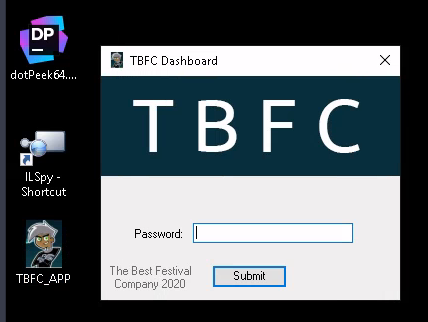
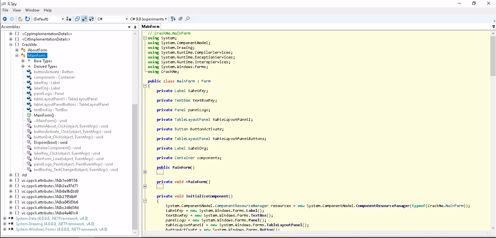
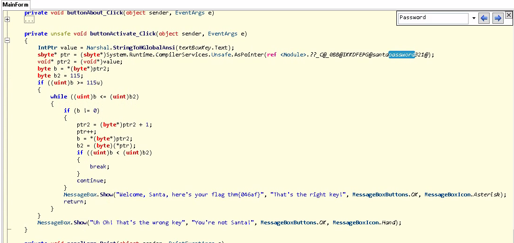
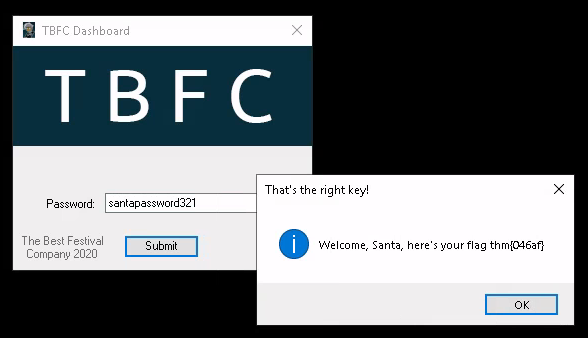

## はじめに

TryHackMeのAdvent of Cyber 2 Day18のWriteUPです。



今回もリバース・エンジニアリングの章になります。


本記事はすべてのセキュリティに携わる人に向けて執筆しており、クラッキングを推奨するものではありません。本記事の手法を用いて、許可された環境以外で実行することは絶対にやめてください。


## The Bits of Christmas

まず、今回のターゲットとなるTBFC_APPがどんなアプリケーションかを軽く確認してみます。

アプリを起動すると、パスワード入力を求められています。

### What is Santa's password?

> サンタのパスワードは何ですか？

今回は.NETで作成されたアプリケーションですので、[ILSpy](https://github.com/icsharpcode/ILSpy)を用いて、デコンパイルしていきます。

ILSpyで開いた結果が以下のようになります。

アプリケーションを確認した際にPasswordという文字列が確認できたので、検索してみます。

それっぽいところが発見できました。

コードを軽く読んでみると、入力された文字列と既に設定されている文字列を比較しているようなコードが確認できます。

サンタのパスワードは、比較元の文字列を入力してあげれば終了です。

### Now that you've retrieved this password, try to login...What is the flag?

> このパスワードを取得したので、ログインしてみてください...フラグは何ですか？

先程得たパスワードをアプリケーションで入力してあげると、flagを取得できます。

アプリケーション上で確認してもいいですし、コード上からも確認できます。

先程のコードで、文字列を比較したあと正しいパスワードが入力されたあとに`Messagebox.Show`でメッセージボックスに表示される文字列が記述されています。

ここを読み解くことで、flagを取得できます。

## おわりに

今回はMicrosoft .NETアプリケーションのリバース・エンジニアリングについてでした。

自分も初めて.NETアプリケーションのデコンパイルをしたので、分からないことも多かったのですが、問題自体は簡単だったので、今までの知識で解くことが出来ました。

CTFでリバース・エンジニアリングの問題が出たときに、常にELFファイルではないということ、その取っ掛かりとしてこの問題はちょうどいいのではないかと思います。
