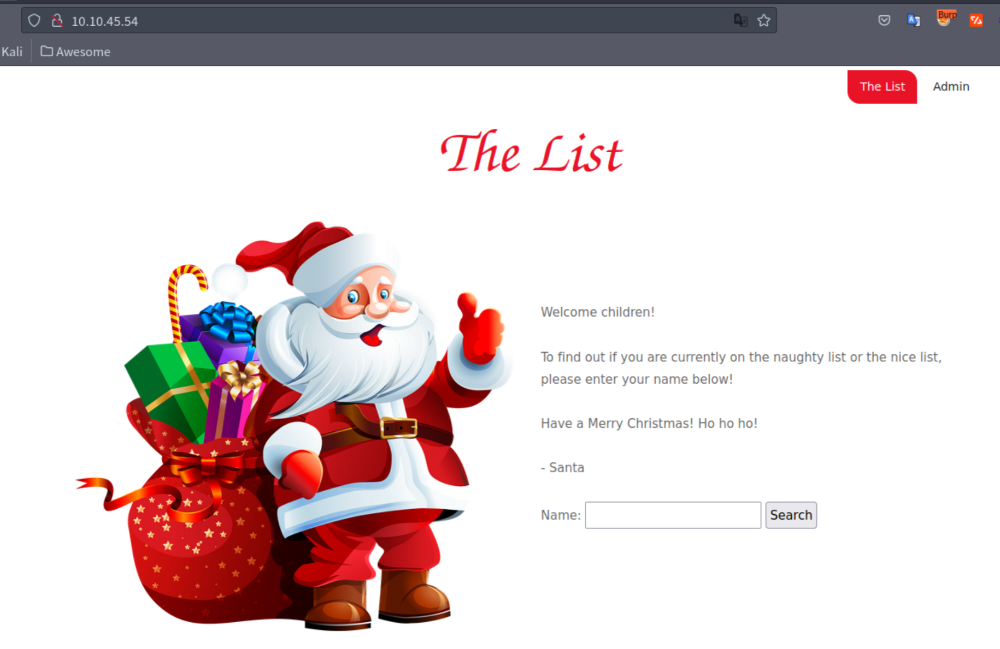
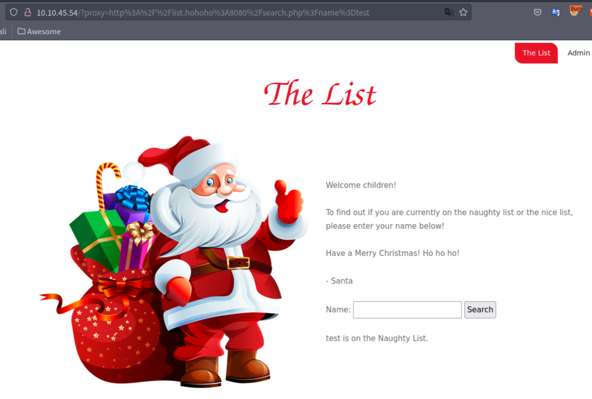
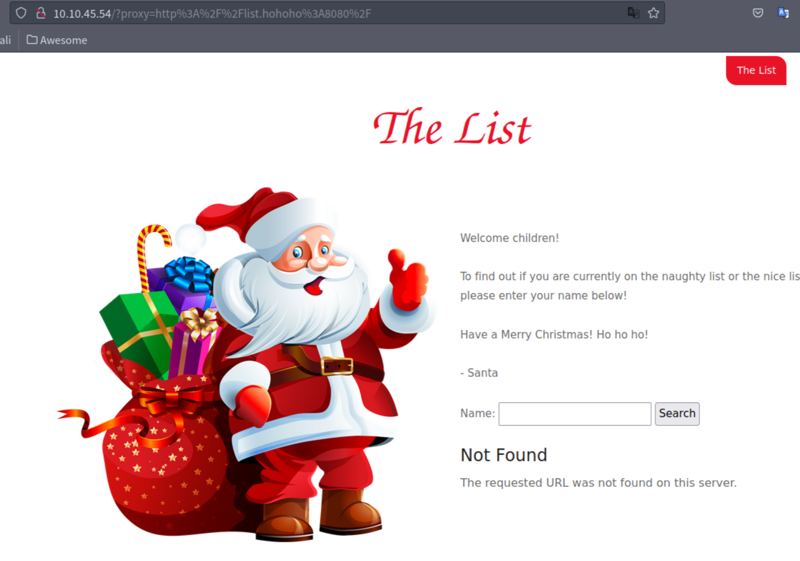
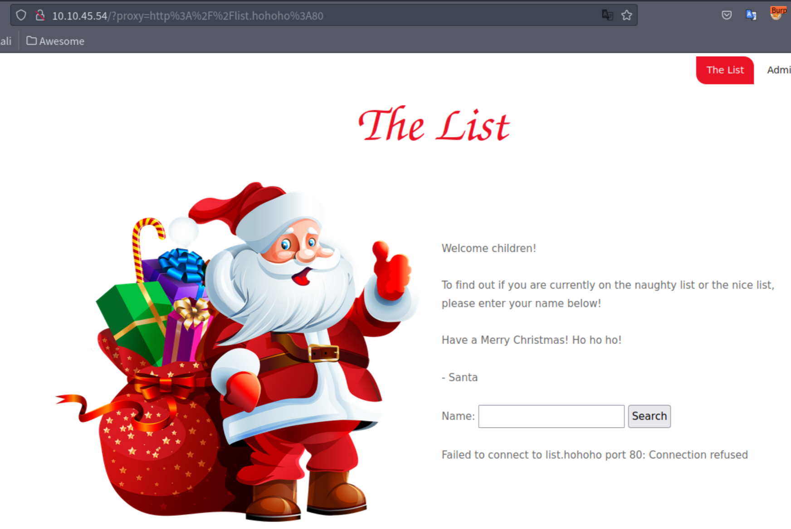
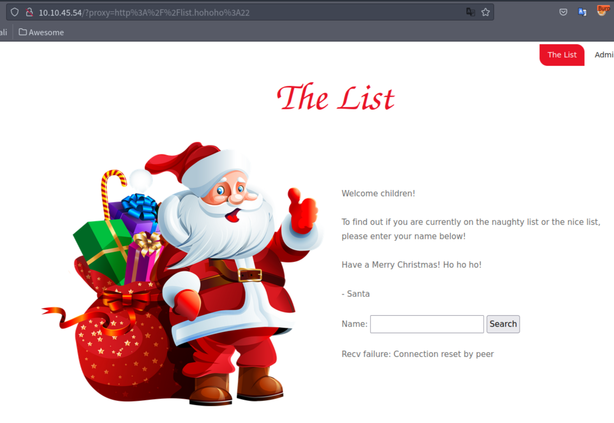
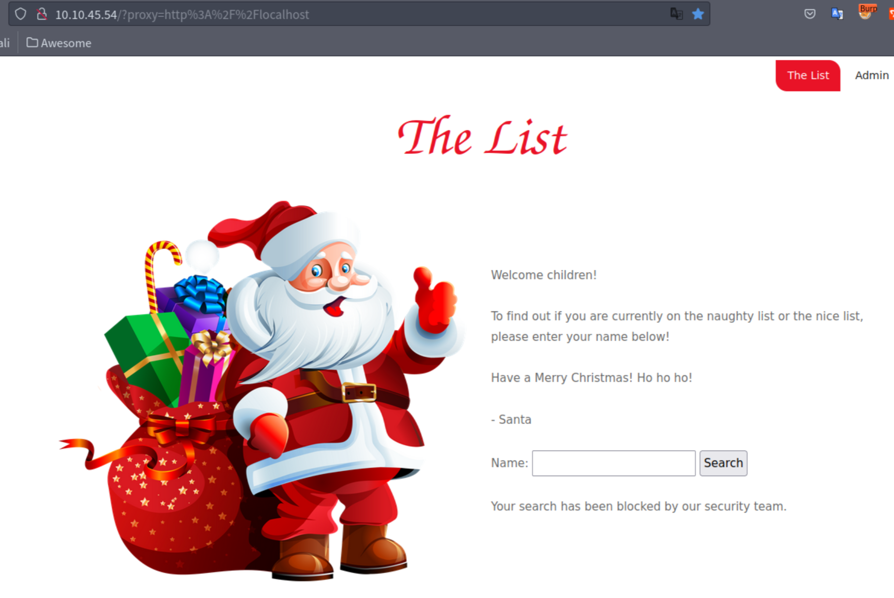
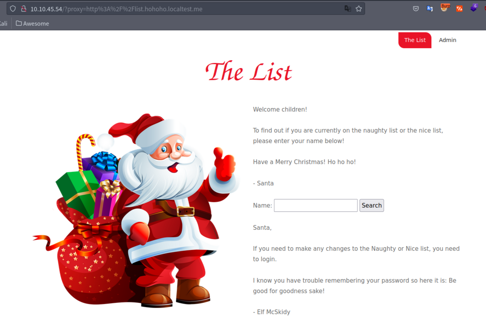

## はじめに

TryHackMeのAdvent of Cyber 2 Day19のWriteUPです。



今回はWebアプリケーションの「Server-Side Request Forgery(SSRF)」の章になります。


本記事はすべてのセキュリティに携わる人に向けて執筆しており、クラッキングを推奨するものではありません。本記事の手法を用いて、許可された環境以外で実行することは絶対にやめてください。


## The Naughty or Nice List

最初にアクセスすると、以下のようなページが表示されます。

テキストボックスに文字列を入力後、「Search」をクリックすると、「`http://10.10.xx.xx/?proxy=http%3A%2F%2Flist.hohoho%3A8080%2Fsearch.php%3Fname%3Dtest`」のようなURLにGETリクエストが飛びます。

クエリーパラメーターにURLの形式があるため、SSRFができるのではないかとあたりをつけます。SSRFの章ですしね笑

「proxy」パラメーターの値はURL decodeしてあげると「`http://list.hohoho:8080/search.php?name=test`」であることがわかります。

では、最初にクエリーパラメーターを「`http://list.hohoho:8080/`」に変更してアクセスしてみます。

メッセージには「Not Found. The requested URL was not found on this server.」と表示され、404エラーと推測される文字列が出てきました。

次に、「`http://list.hohoho:80`」にアクセスしてみます。

「Failed to connect to list.hohoho port 80: Connection refused」と表示され、ポート80が空いていないことがわかります。

また、「`http://list.hohoho:22`」にアクセスしてみます。

エラーメッセージが変わり、「Recv failure: Connection reset by peer」と表示されるようになりました。これにより、22番のポートが開いていることが分かります。

つまり、Webアプリケーションから内部の「list.hohoho」の空いているポートが分かってしまっている状態です。

このように、本来アクセス出来ないサーバーに対して、Webアプリケーションを通してアクセス出来る攻撃をSSRF攻撃です。

### What is Santa's password?

次は「http://localhost」にアクセスを試みます。

メッセージには、「Your search has been blocked by our security team.」と表示され、アクセスが出来ないようになっています。list.hohohoが含まれているかどうかをチェックしているみたいです。

本文中に、「`localtest.me`」は全てのサブドメインを「127.0.0.1」に名前解決しますとあるため、クエリーパラメーターに「http://list.hohoho.localtest.me」を設定してアクセスしてあげます。

無事、パスワードと思しき文字列が表示されていることが分かります。

### What is the challenge flag?

Santaのパスワードが分かったので、Adminからログインして終了です。

## おわりに

今回はWebアプリケーションの脆弱性SSRFを用いて内部の情報を得るという問題でした。

時間としては、1時間半から2時間程度で終了しました。

Webアプリケーションの脆弱性診断をやっている方や、少しセキュリティについて詳しい方であれば、「あぁ、あれね」と比較的わかりやすい問題でした。

また、全くセキュリティがわからない人でも、Walktrhough形式になっているので、詰まることなく進められると思います。
