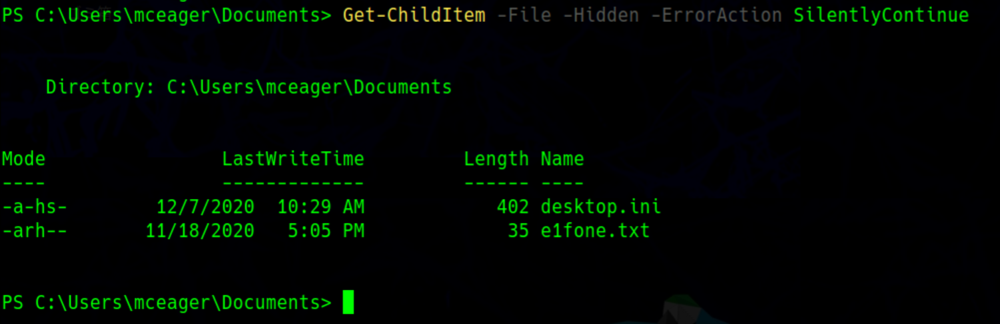
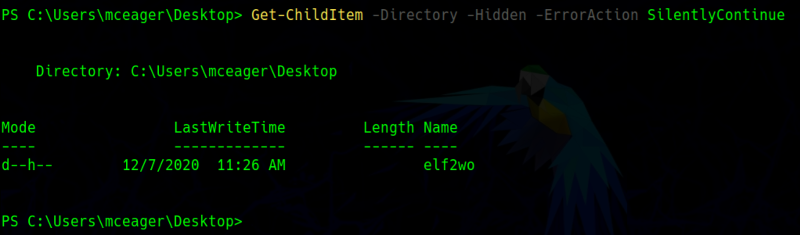
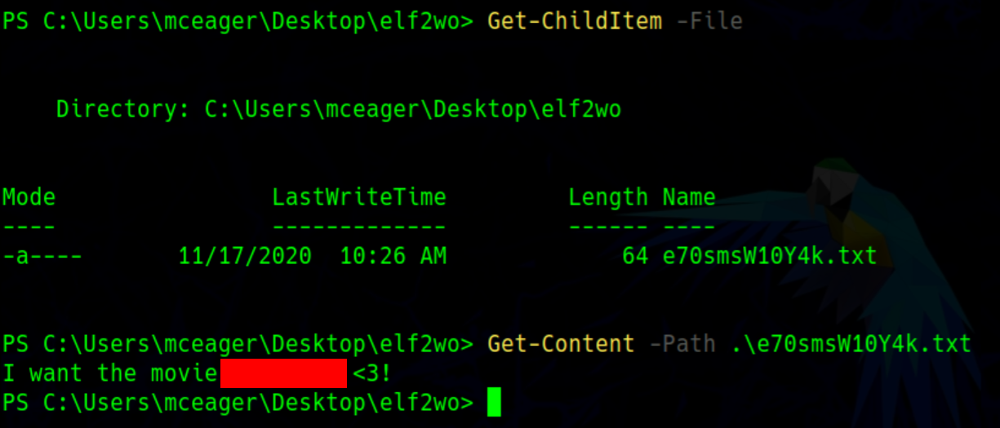
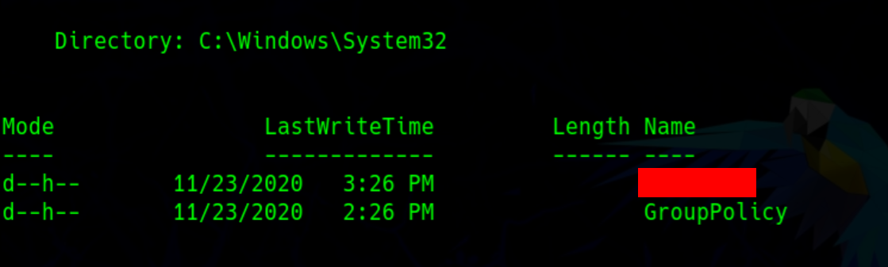
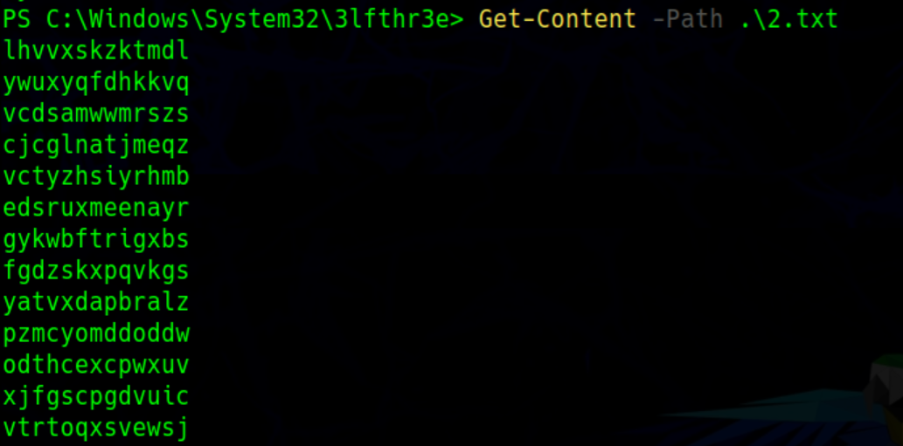

## はじめに

TryHackMeのAdvent of Cyber 2 Day20のWriteUPです。

今回はPowerShellの章になっています。




本記事はすべてのセキュリティに携わる人に向けて執筆しており、クラッキングを推奨するものではありません。本記事の手法を用いて、許可された環境以外で実行することは絶対にやめてください。


## PowershELlF to the rescue

### Search for the first hidden elf file within the Documents folder. Read the contents of this file. What does Elf 1 want?

> Documentsフォルダー内の隠しelfファイルを検索します。そのファイルの中身を確認します。Elf 1は何を望んでいますか？

SSHでログイン後、PowerShellに切り替え、Documentsフォルダーへ移動します。

```powershell
Set-Location '.\Documents\'
```

隠されたファイルを検索します。

```powershell
Get-ChildItem -File -Hidden -ErrorAction SilentlyContinue
```



「`e1fone.txt`」が怪しいので、その中身を確認します。

ファイルの中身を見るコマンドは以下のとおりです。

```powershell
Get-Content -Path .\e1fone.txt
```

ファイルの中身を確認すると、flagが獲得できます。

### Search on the desktop for a hidden folder that contains the file for Elf 2. Read the contents of this file. What is the name of that movie that Elf 2 wants?

> デスクトップでElf2のファイルを含む隠しフォルダーを検索します。このファイルの内容を読みます。エルフ2が望んでいるその映画の名前は何ですか？

先程と同様に、Desktopに移動します。

```powershell
Set-Location -Path C:\Users\mceager\Desktop\
```

同様にして、今回はファイルではなくフォルダーを確認します。

```powershell
Get-ChildItem -Directory -Hidden -ErrorAction SilentlyContinue
```



隠しフォルダーを見つけたので、そちらに移動し、ファイルの中身を確認してflagを取得します。



### Search the Windows directory for a hidden folder that contains files for Elf 3. What is the name of the hidden folder? (This command will take a while)

> Windowsディレクトリで、Elf 3のファイルを含む隠しフォルダを検索します。隠しフォルダの名前は何ですか？ （このコマンドにはしばらく時間がかかります）

再帰的に検索するオプションもあるため、そちらを使います。

```powershell
Get-ChildItem -Path C:\Windows\ -Directory -Recurse -Hidden -ErrorAction SilentlyContinue
```

大量に検索結果が出てきますが、その中の「`C:\Windows\System32\`」配下に怪しいフォルダが確認できます。



この隠しフォルダーの名前がflagになります。

### How many words does the first file contain?

> 最初のファイルにはいくつの単語が含まれていますか？

ファイルの中身の単語数を数えるコマンドもあるため、そちらを使用します。

```powershell
Get-Content -Path 1.txt | Measure-Object -Word
```

### What 2 words are at index 551 and 6991 in the first file?

> 最初のファイルのインデックス551と6991にある2つの単語は何ですか？

indexを指定できるため、それぞれ確認していきます。

```powershell
(Get-Content -Path 1.txt)[551]
```

```powershell
(Get-Content -Path 1.txt)[6991]
```

### This is only half the answer. Search in the 2nd file for the phrase from the previous question to get the full answer. What does Elf 3 want? (use spaces when submitting the answer)

> これは答えの半分にすぎません。 2番目のファイルで前の質問のフレーズを検索して、完全な回答を取得します。 Elf 3は何を望んでいますか？ （回答を送信するときはスペースを使用してください）

まずは、「`2.txt`」の中身を確認します。

```powershell
Get-Content -Path .\2.txt
```

すると、意味をなさない文字列が大量に表示されます。



ここで、問題文にもあるように、一つ前のflagの文字列でパターン検索してきます。

```powershell
Select-String -Path .\2.txt -Pattern 'xxxxxxx'
```

これでflagは取得できます。

## おわりに

時間は1時間半程度で終了しました。

PowerShellはほとんど触れてこなかったので、コマンド類はほとんど知りませんでしたが、本文中に記載があるため初学者でも詰まることなく進めることができると思います。

これと他にMicrosoftからPowerShellのドキュメントも出ているので、ここで確認しながらコマンドを打っていました。



OSCPやTHM, HTBでもWindowsは避けては通れない道なので、苦手意識を持たずに取り組んで行けたらと感じました。
