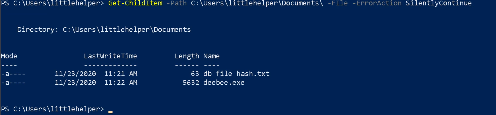
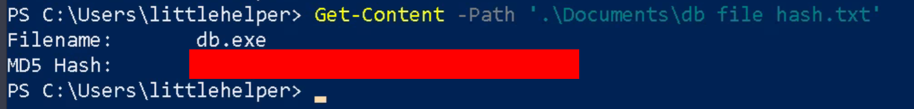
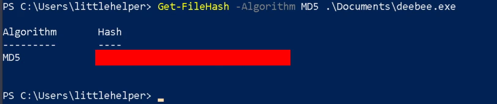
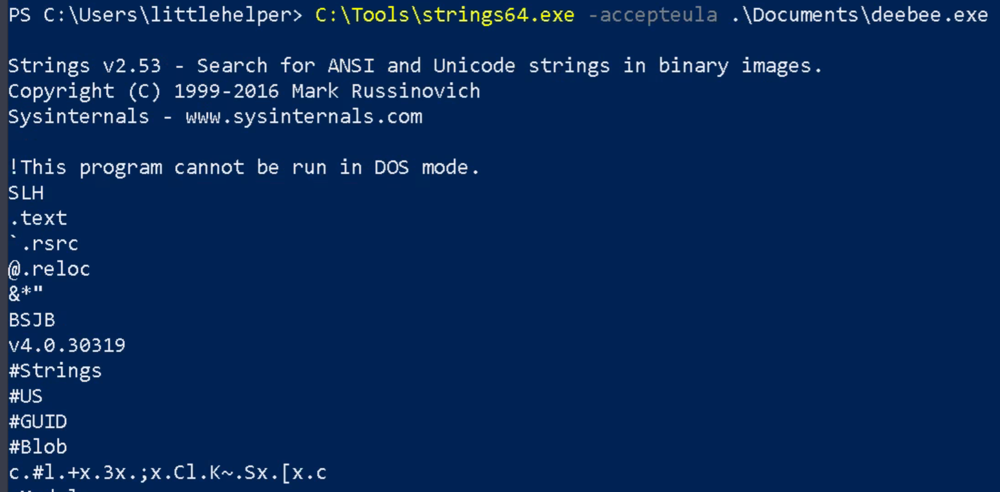
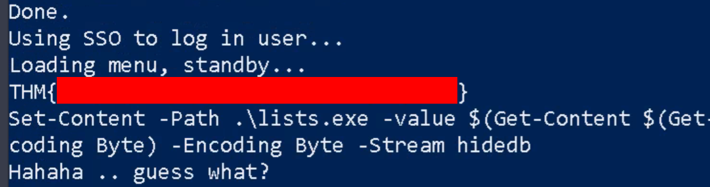
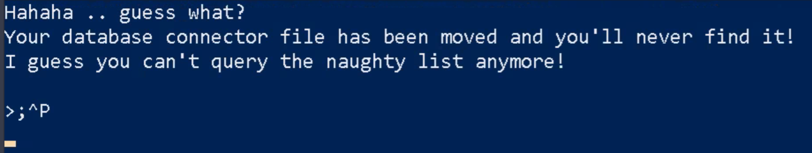
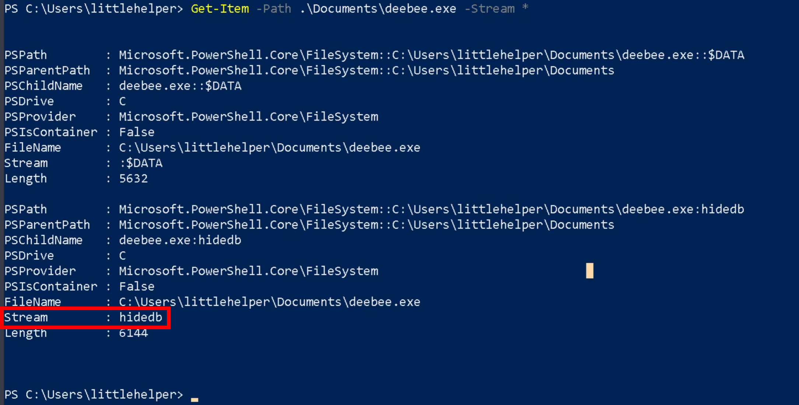
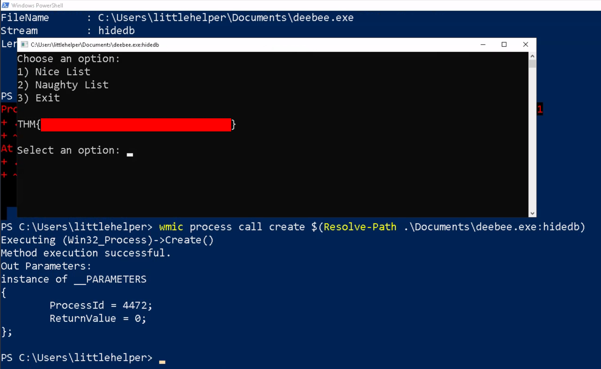

## はじめに

TryHackMeのAdvent of Cyber 2 Day21のWriteUPです。



今回もPowerShellを用いた章になります。


本記事はすべてのセキュリティに携わる人に向けて執筆しており、クラッキングを推奨するものではありません。本記事の手法を用いて、許可された環境以外で実行することは絶対にやめてください。


## Time for some ELForensics

### Read the contents of the text file within the Documents folder. What is the file hash for db.exe?

> Documentsフォルダ内のテキストファイルの内容を読みます。 db.exeのファイルハッシュは何ですか？

まずは、前回の内容のおさらいです。

Documentsフォルダー内のテキストファイルを検索するために、「`Get-ChildItem`」を使用します。

「`Get-ChildItem`」のDocumentはこちらです。



```powershell
Get-ChildItem -Path C:\Users\littlehelper\Documents\ -File -ErrorAction SilentlyContinue
```

実行結果は以下のとおりです。「`db file hash.txt`」がそのファイルに当たりそうですね。



ファイルの中身を確認するために、「`Get-Content`」を使用します。

「`Get-Content`」のDocumentはこちらです。



```powershell
Get-Content -Path '.\Documents\db file hash.txt'
```

テキストの中身は、ファイル名とMD5のハッシュ値が保存されているようです。



「MD5 Hash:」に記載されているハッシュ値がflagになります。

### What is the file hash of the mysterious executable within the Documents folder?

> Documentsフォルダー内の謎の実行ファイルのファイルハッシュ値を教えてください。

先程、Documents配下を検索した際に、「`deebee.exe`」があることを確認しています。

そのファイルのハッシュ値を「`Get-FileHash`」を用いて計算します。

「`Get-FileHash`」のDocumentはこちらです。



```powershell
Get-FileHash -Algorithm MD5 '.\Documents\deebee.exe'
```

Hashが出力されたので、それがflagになります。



### Using Strings find the hidden flag within the executable?

> Stringsを使用して、実行可能ファイル内の隠しフラグを見つけますか？

stringsコマンドはLinuxでもよく使用されるものですね。

マシン内では、「`C:\Tools\Strings64.exe`」としてあるそうなので、そちらを使用します。

```powershell
C:\Tools\Strings64.ext -accepteula .\Documents\deebee.exe
```

実行すると、実行ファイル内の文字列が表示されています。



その中に、「THM{xxxxxxxxxxxxxx}」の文字列があるので、それがflagになります。



### What is the flag that is displayed when you run the database connector file?

> データベースコネクターファイルを実行した際に表示されるフラグは何ですか？

先程のファイルを実行すると、以下のように ~~**煽り**~~ メッセージが表示されます。



Widnowsの標準ファイルシステムである「NTFS(New Technology File System)」では、ファイルやフォルダーに保存できる隠しファイルとして「Alternate Data Stremas（ADS）」というものがあるそうです。

PowerShellでは、以下のコマンドで確認することが出来ます。

```powershell
Get-Item -Path .\Documents\deebee.exe -Stream *
```

「Get-Item」のDocumentはこちらです。



実行すると、Streamが異なるhiddenファイルを確認できます。



ADS内に隠されているhiddenファイルは、以下のコマンドで実行できます。

```powershell
wmic process call create $(Resolve-Path .\Documents\deebee.exe:hidedb)
```

実行すると、flagを取得できます。



## おわりに

今回もWindowsの章でしたが、自分の知らない知識が多く調べながら取り組みました。

特に、4問目なんかは自分の知識のみでは解けず、本文中に記載があったためそれをもとに調べながら解けたという感じです。

時間としては、1時間半から2時間程度で、全ての問題を解き終わりました。
