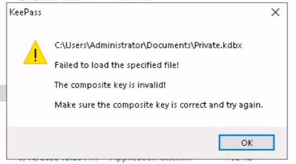
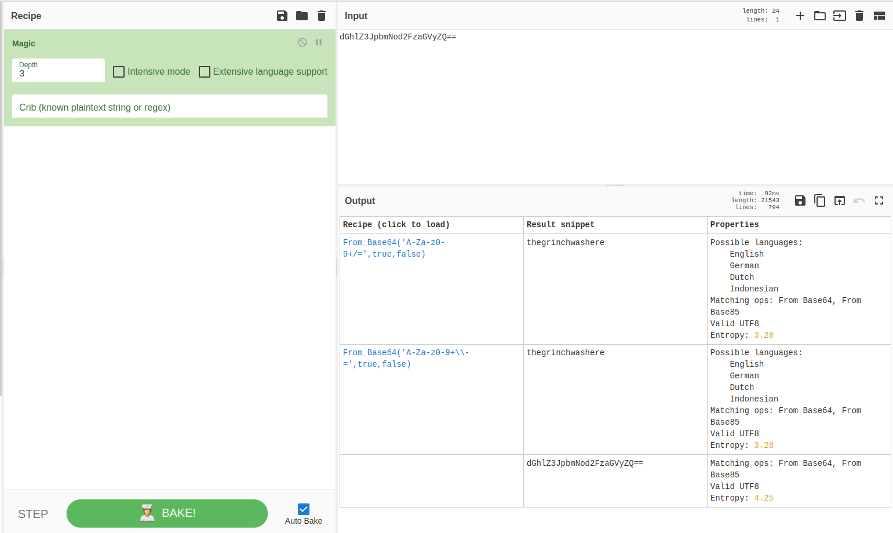
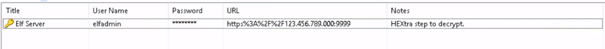
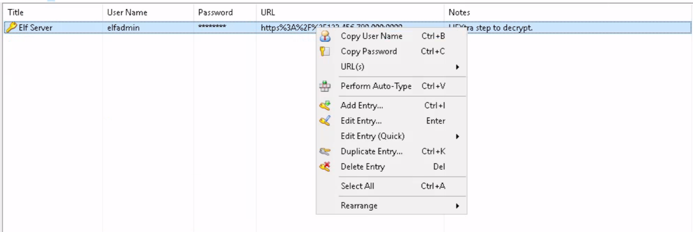
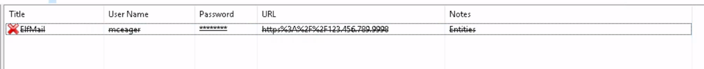
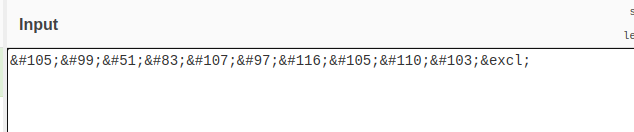
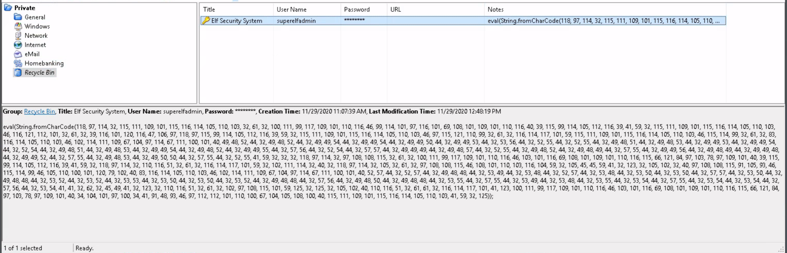
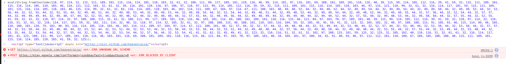

## はじめに

TryHackMeのAdvent of Cyber 2 Day22のWriteUPです。

今回はEncode/Decodeの章になります。




本記事はすべてのセキュリティに携わる人に向けて執筆しており、クラッキングを推奨するものではありません。本記事の手法を用いて、許可された環境以外で実行することは絶対にやめてください。


## Elf McEager becomes CyberElf

### What is the password to the KeePass database?

> KeePassデータベースのパスワードは何ですか？

まずは、KeePassを実行し本文中に記載されていたマスターパスワード「mceagerrockstar」を入力すると、キーが間違えているとエラーが表示されます。



ここで、フォルダ名に注目すると、Base64でエンコードされたような形式であることが分かります。

このフォルダ名をBase64でデコードしてあげたものが、KeePassのマスターパスワードとなります。

今回はデコードに「CyberChef」を使用します。



Inputにフォルダ名を入れ、From Base64を選択すればFlagを取得できます。

### What is the encoding method listed as the 'Matching ops'?

> 'Matching ops'としてリストされているエンコード方法は何ですか？

CyberChefの使い方がメインの話です。

Base64であることが分からない場合、CyberChefではデコードを検知してくれる機能もあります。



### What is the decoded password value of the Elf Server?

> Elfサーバーのデコードされたパスワード値は何ですか？

KeePassにログインしたあと、Elf Serverを確認します。



パスワードをコピーし、Notesにあるとおり、HEX to ASCIIをして終了です。



CyberChefに貼り付けるだけでもflagを取得できます。

### What is the decoded password value for ElfMail?

> ElfMailのデコードされたパスワード値は何ですか？

ElfMailのパスワードをコピーします。



中身を確認すると、HTMLエンコードされていることが分かります。



デコードしてあげて、flagを取得します。

### Decode the last encoded value. What is the flag?

> 最後にエンコードされた値をデコードします。flagは何ですか？

Recycle Binの中身を確認すると、以下の画像が確認できます。



Notesを確認するとJavaScriptのevalが確認できるので、ブラウザーのコンソールで確認してみます。



以下の文字列が確認できます。

```html
<script type="text/javascript" async="" src="hhttps://gist.github.com/heavenraiza/"></script>
```

URLがhhttpsとなっているためアクセスできていないようでした。

URLをベタ打ちして確認すると、githubのgistページが確認できます。そこからflagを取得できます。

## おわりに

今回は主にdecodeを学べる章でした。

時間は1時間~1時間半程度で終了しました。

問題自体は複雑なことは一切なく、基本的な暗号化、復号化を学べると思います。
