## はじめに

TryHackMeのAdvent of Cyber 2 Day22のWriteUPです。

今回はランサムウェアについてです。




本記事はすべてのセキュリティに携わる人に向けて執筆しており、クラッキングを推奨するものではありません。本記事の手法を用いて、許可された環境以外で実行することは絶対にやめてください。


## The Grinch strikes again!

### Decrypt the fake 'bitcoin address' within the ransom note. What is the plain text value?

> `ransome note`内の偽の「ビットコイン アドレス」を解読します。プレーンテキストの値は何ですか?

Desktop上にある「`RansomeNote`」を開くと以下のようなメモが確認できます。

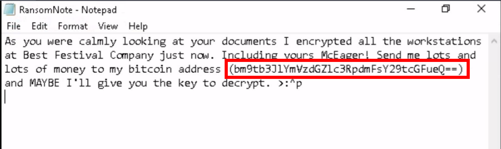

以下のように、Base64でエンコードされているような文字列が確認できます。

```
bitcoin address (bm9tb3JlYmVzdGZlc3RpdmFsY29tcGFueQ==)
```

これをデコードしてflagを得ます。

### At times ransomware changes the file extensions of the encrypted files. What is the file extension for each of the encrypted files?

> ランサムウェアは、暗号化されたファイルのファイル拡張子を変更することがあります。暗号化された各ファイルのファイル拡張子は何ですか?

エクスプローラーを確認し、暗号化されているファイルを確認することでflagを獲得できます。

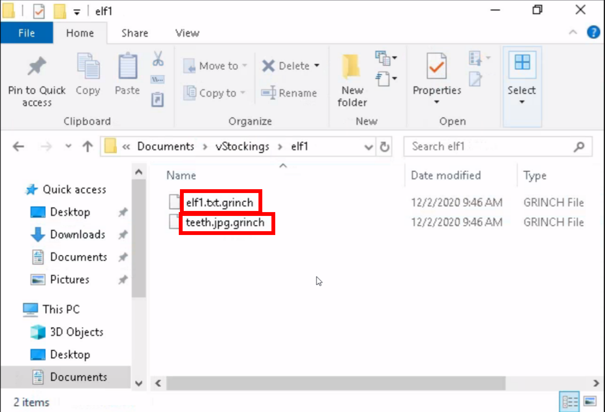

### What is the name of the suspicious scheduled task?

> 怪しいスケジュールタスクの名称は？

「Task Scheduler」を確認すると、それらしいスケジュールタスクを確認できるので、それがflagとなります。

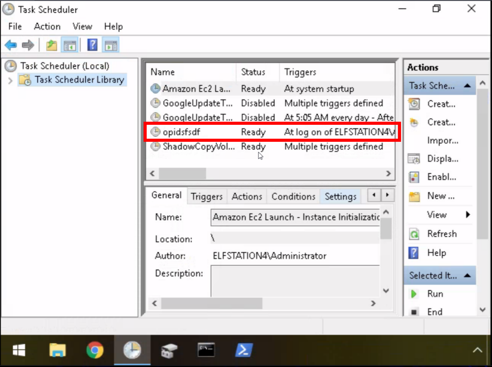

### Inspect the properties of the scheduled task. What is the location of the executable that is run at login?

> スケジュールされたタスクのプロパティを調べます。ログイン時に実行される実行可能ファイルの場所は?

「Task Scheduler」にて、該当のタスクを確認します。`Actions`タブに「Start Programs」が確認できます。

Detailsに書かれているPathを入力して終了です。

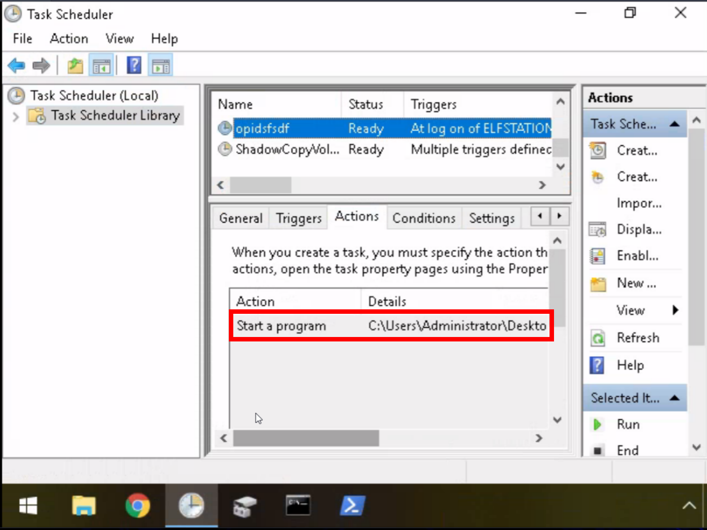

### There is another scheduled task that is related to VSS. What is the ShadowCopyVolume ID?

> VSS に関連する別のスケジュールされたタスクがあります。 ShadowCopyVolume ID とは何ですか?

同様に「Task Scheduler」の「ShadowCopyVolume」を確認します。

UUIDが確認できるので、それがflagです。

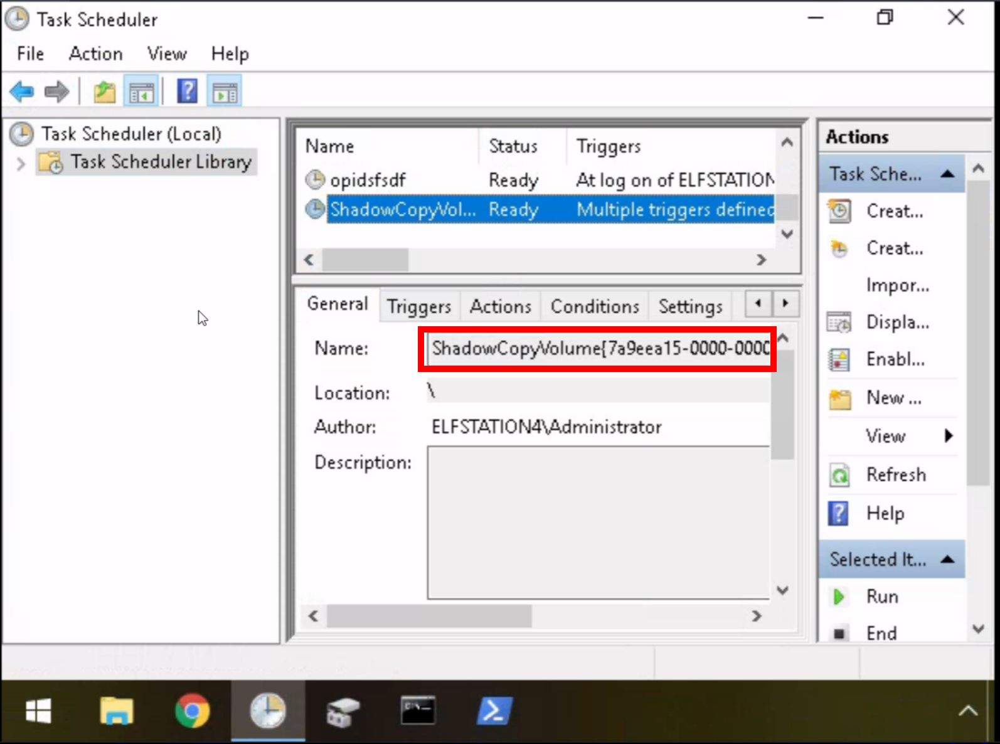

### Assign the hidden partition a letter. What is the name of the hidden folder?

> 隠しパーティションに文字を割り当てます。隠しフォルダの名前は何ですか?

「Disk Management」を確認します。

Backupパーティションを右クリックで選択し、「`Change Drive Letter and Paths`」を選択します。

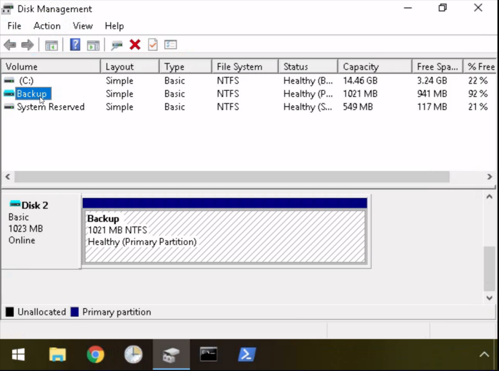

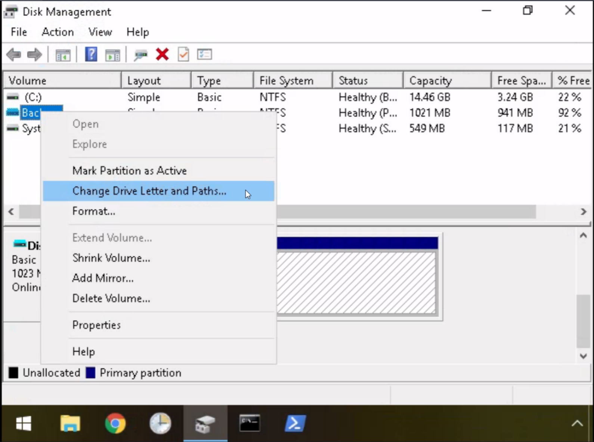

Backupパーティションを追加してあげることでが、Dドライブとして認識されたことを確認します。

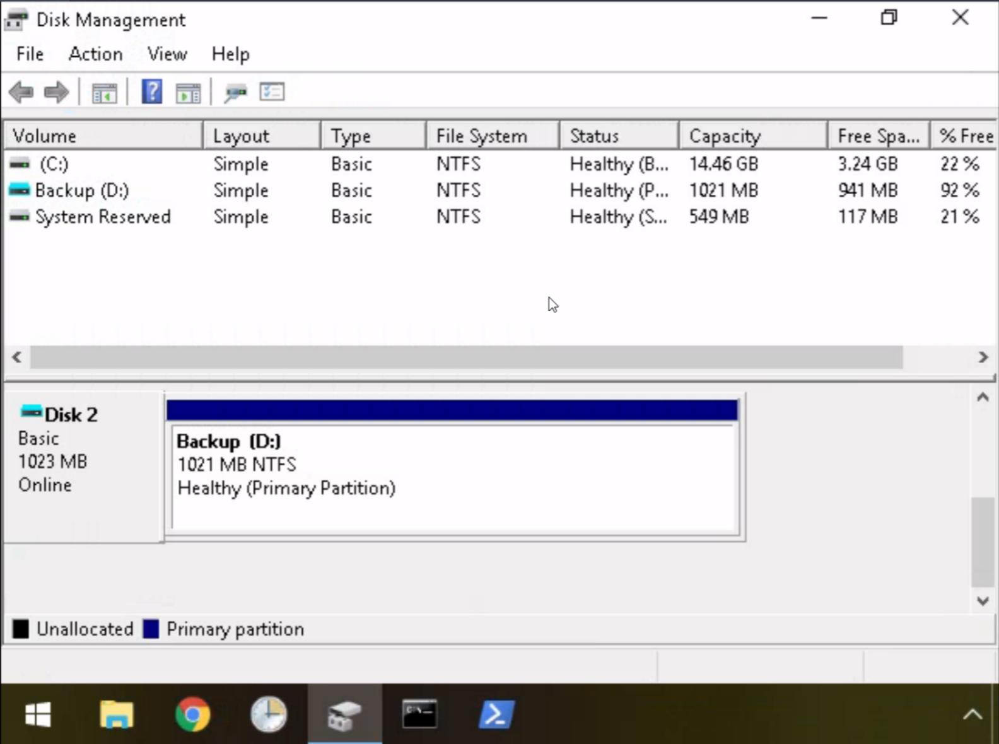

Backupディレクトリの中は、以下の様になっていることが確認できます。

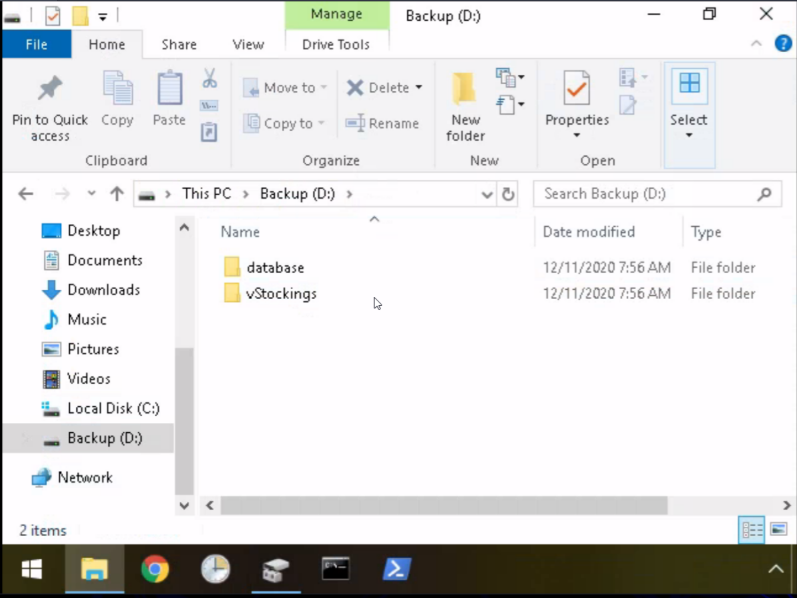

エクスプローラー上で隠しフォルダを表示して隠しディレクトリが確認できます。

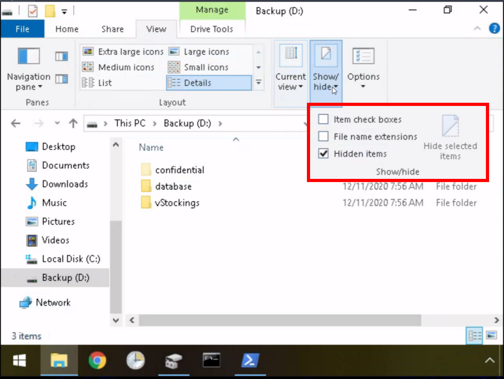

### Right-click and inspect the properties for the hidden folder. Use the 'Previous Versions' tab to restore the encrypted file that is within this hidden folder to the previous version. What is the password within the file?

> 右クリックして、隠しフォルダーのプロパティを調べます。 [以前のバージョン] タブを使用して、この隠しフォルダー内にある暗号化されたファイルを以前のバージョンに復元します。ファイル内のパスワードは何ですか?

遷移の通りに確認するとファイルが確認できます。ファイルの中身がflagになります。

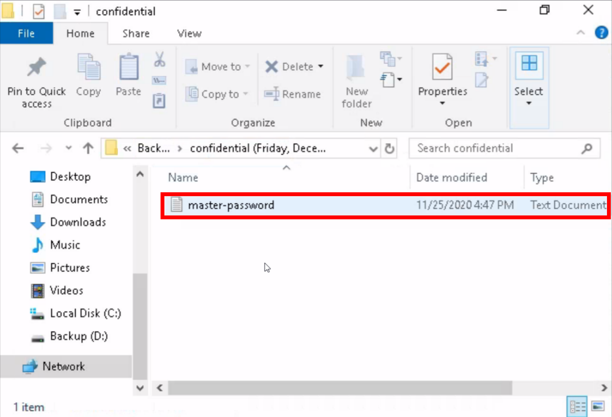

## おわりに

今回はWindows端末がランサムウェアに感染した場合を想定したRoomでした。

時間は1時間程度で終了しました。

問題自体は簡単ですが、Windowsの保護機能などを深く学ぶきっかけになると思います。
